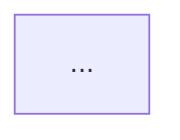

# agent-02-target-architecture.md
## Mission: Create the **Target Architecture + Refactor Plan** report (best possible)

You are Agent 2 operating **inside the repository**. Your job is to produce a **to-be (target) architecture specification** and a **phased refactor plan** that transforms the current codebase into that target.

This is *not* another as-is description. Use the as-is reports as inputs and produce a forward-looking, actionable plan.

---

## Inputs you MUST read first

1) `refactor-intake-report1.md`  
2) `refactor-intake-report2.md`

Treat them as the authoritative baseline. If they disagree, call it out and resolve by checking the code.

---

## Output (single file)

Create exactly one file:

- `refactor-target-report.md`

No extra files.

---

## How good “best possible” looks

Your report must be:
- **Concrete**: file paths, symbol names, and “what changes where”.
- **Constraint-aware**: preserve key behavior and tests; avoid big-bang rewrites.
- **Operational**: include rollout strategy, risk analysis, and validation steps.
- **Diagram-driven**: use Mermaid diagrams for architecture and flows.
- **Compatible with the intended model**: adapters are protocol↔envelope converters; core knows only ports/handlers; runtime owns pipeline/telemetry/routing.

---

## Target model requirements (To-Be)

### Core / Ports
- Core code must not import adapters, protocol libs, or concurrency primitives.
- Core exposes only decorated handlers:
  - `@inbound_port(name)` handlers: `Envelope -> Envelope | None`
  - `@outbound_port(name)` factories: `domain args -> Envelope`
- Port names are the stable core API surface.

### Envelope
- Envelope is **data-only** (no tracing/span methods on it).
- Telemetry context lives as fields (e.g., W3C trace context), but span creation is done in runtime middleware.

### Runtime
Runtime owns the canonical pipeline:
- lifecycle (start/stop/drain)
- routing (inbound resolve + outbound target selection)
- backpressure + concurrency gates
- retries/timeouts (policy-driven)
- observability middleware (tracing, metrics, structured logging)

### Adapters
- Adapters do only IO + conversion:
  - inbound: protocol -> envelope -> runtime.dispatch(...)
  - outbound: runtime.deliver(...) -> envelope -> protocol send
- Bidirectional protocols (WebSocket, NATS request-reply) must be supported as first-class.
- Runtime must not directly import concrete adapter classes; use an adapter factory/plugin mechanism.

### Routing & Wiring
- Configuration drives:
  - enabled adapters + settings
  - inbound routes (protocol match → inbound_port)
  - outbound routes (env.name → targets)
  - policies (retry/backoff/backpressure/rate limits/timeouts)
- Dynamic registration at runtime should be possible (at least via explicit API), even if hot reload is deferred.

---

## Required sections in `refactor-target-report.md`

### 1) Executive Summary (<= 20 lines)
- What changes (in one paragraph)
- 5 “big moves” (bullets)
- 5 “non-goals / not now” (bullets)
- Compatibility stance: breaking vs non-breaking

### 2) Target Architecture (Outside-In)
Include:
- Component diagram (Mermaid)
- Responsibilities table (Server/Runtime/Registry/Pipeline/Core/Adapters)
- “Core knows only ports” contract, shown as a short code sketch

### 3) Canonical Pipeline Spec
Define the pipeline stages and the exact order.

Include a diagram:

For each stage:
- input/output
- where telemetry happens
- failure behavior
- which policies apply

### 4) Registry / Router Spec
Define registries explicitly:
- InboundPortRegistry
- OutboundPortRegistry
- AdapterRegistry
- RouteRegistry (inbound match + outbound targets)
- CodecRegistry (optional)
- PolicyRegistry

Describe:
- keys, values, lookup rules
- how handlers are discovered (module scanning vs explicit registration)
- how you remove per-adapter importlib logic (central handler loader)

### 5) Adapter Model (including bidirectional)
- Unified adapter interface (describe methods)
- How inbound adapters call runtime
- How outbound delivery calls adapters
- How request/reply correlation works (fields, reply_to, etc.)
- How WebSocket/NATS should be represented (one adapter vs split inbound/outbound)

Include at least one sequence diagram for bidirectional request/reply.

### 6) Envelope Spec (Target)
- List fields (required/optional)
- Telemetry fields (traceparent/baggage/correlation id)
- Error envelope format
- Versioning approach (env.name with v1/v2)
- Mapping rules from current Envelope to target Envelope (explicit migration mapping)

### 7) Observability Spec
Define:
- span naming conventions (ingress/dispatch/core/egress)
- metrics naming conventions (in/out/errors/latency/queue depth)
- logging fields (trace_id, msg_id, env.name, port, adapter, stage)
- exactly where tracing context is extracted/injected (adapter boundaries)

### 8) Config Model (Target)
Provide:
- Proposed config schema (YAML)
- How existing config maps to new schema (migration)
- Backward compatibility strategy (support old fields with warnings vs hard cut)
- Whether hot reload is planned now or later

### 9) Phased Refactor Plan (the most important part)
Provide **phases** with:
- goal
- exact changes (what modules/classes)
- safety net (tests to add/verify)
- rollback plan
- expected risk level

Requirements:
- Each phase must be independently shippable and keep tests green.
- Include “compat shims” where needed (Envelope methods, old config fields, old outbound binding style).

### 10) File-Level Change List
Create a table:

- File/Module | Change type (edit/move/split/new/delete) | What changes | Why | Risk

Be specific (e.g., “move handler loading from adapters/http/inbound_adapter.py to registry/handler_loader.py”).

### 11) Validation Plan
- test commands to run
- new integration tests to add (2–3 critical flows)
- performance/regression checks
- observability checks (trace continuity across inbound→core→outbound)

### 12) Open Decisions (with recommendations)
List any decisions that require the repo owner’s choice (e.g., async-only runtime now vs later), but **still recommend a default**.

---

## Quality checklist (must satisfy)
Before finishing, ensure:
- All proposed changes are grounded in the existing code structure described in the intake reports.
- You explicitly fix these pain points (as found in intake):
  - runtime imports concrete adapters
  - handler loading duplicated in adapters
  - outbound adapters bound as port handlers (confusing)
  - no explicit canonical pipeline
  - envelope contains tracing behavior
  - mixed concurrency model without a unifying strategy
- The plan includes at least one path to “minimal target” (Phase 1–3) before any bigger concurrency rewrite.

---

## Repo exploration commands (English)
Use these while writing the report:

- `tree -L 4`
- `rg "class Runtime|_create_inbound_adapter|_create_outbound_adapter|register_handler|@port|@inbound|@outbound|Envelope\("`
- `rg "importlib\.import_module|load_handler|handler:" -S`
- `rg "start_span|finish_span|trace_id|span_id|traceparent|opentelemetry" -S`
- `pytest -q`
- `pytest tests/integration -q` (if present)

When citing code, use `path:line-range` in the report.

---

## Tone & formatting
- Write in **German** for explanations.
- Keep all code snippets and CLI commands in **English**.
- Use headings, bullet lists, and Mermaid diagrams.
- Avoid vague wording like “should” without specifying what and where.

