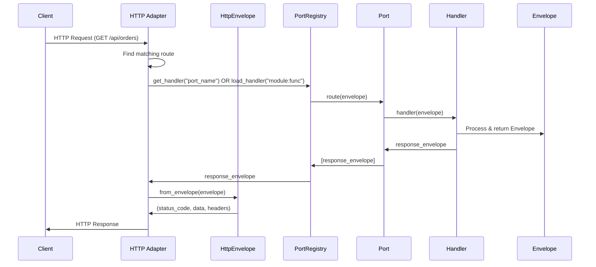
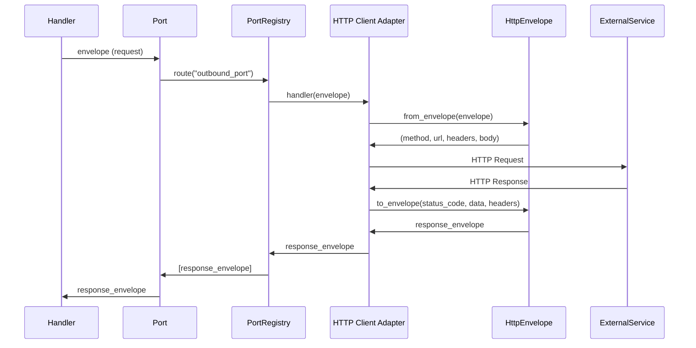

# HexSwitch Refactor Intake Report

## 1) Executive Snapshot

**What the framework currently is:**
HexSwitch ist ein konfigurationsgetriebenes Runtime-System für Microservices, das auf dem Hexagonal Architecture Pattern (Ports & Adapters) basiert und eine protokoll-agnostische Verbindung zwischen Business-Logik und verschiedenen Kommunikationsprotokollen ermöglicht.

**Core Abstractions:**
- **Envelope**: Kanonisches Nachrichtenmodell (`src/hexswitch/shared/envelope.py:10-241`)
- **Port**: Named connection point zwischen Adaptern und Handlern (`src/hexswitch/ports/port.py:9-51`)
- **InboundAdapter/OutboundAdapter**: Basis-Interfaces für Adapter (`src/hexswitch/adapters/base.py:7-60`)
- **Runtime**: Orchestrator für Adapter-Lifecycle (`src/hexswitch/runtime.py:144-454`)
- **PortRegistry**: Zentrales Registry für Handler-Registrierung (`src/hexswitch/ports/registry.py:12-191`)

**Where components live:**
- **Runtime**: `src/hexswitch/runtime.py`
- **Registry**: `src/hexswitch/ports/registry.py`
- **Envelope**: `src/hexswitch/shared/envelope.py`
- **Adapters**: `src/hexswitch/adapters/{http,grpc,websocket,mcp,nats}/`
- **Ports/Handlers**: `src/hexswitch/ports/`, `src/hexswitch/handlers/`
- **Config**: `src/hexswitch/shared/config/`
- **Observability**: `src/hexswitch/shared/observability/`

**Biggest architectural pain points (Top 5):**
1. **Runtime importiert alle Adapter-Typen direkt** (`runtime.py:8-12`) - Verletzung der Core-Boundary, Core kennt konkrete Adapter-Implementierungen
2. **Handler-Loading erfolgt zur Laufzeit in jedem Adapter** (`adapters/http/inbound_adapter.py:204-228`) - Code-Duplikation, keine zentrale Handler-Loading-Logik
3. **Keine asyncio-Integration** - Runtime verwendet Threads (`runtime.py:407-422`), aber WebSocket/gRPC-Adapter nutzen asyncio, was zu Mischung führt
4. **Envelope hat direkte Observability-Integration** (`envelope.py:108-196`) - Envelope sollte nicht wissen, wie Tracing funktioniert
5. **Routing-Strategien sind hardcoded** - Keine konfigurationsgetriebene Routing-Strategie-Auswahl pro Port

---

## 2) Current Architecture Map

```mermaid
flowchart TB
    subgraph "Entry Points"
        CLI[app.py<br/>CLI Entry]
        Runtime[Runtime.run_runtime<br/>runtime.py:429]
    end

    subgraph "Runtime Orchestrator"
        RT[Runtime Class<br/>runtime.py:144]
        Plan[build_execution_plan<br/>runtime.py:28]
    end

    subgraph "Registry/Container"
        PR[PortRegistry<br/>ports/registry.py:12]
        Port[Port<br/>ports/port.py:9]
        Strategy[RoutingStrategy<br/>ports/strategies.py:10]
    end

    subgraph "Inbound Adapters"
        HTTP_IN[HttpAdapterServer<br/>adapters/http/inbound_adapter.py:302]
        WS_IN[WebSocketAdapterServer<br/>adapters/websocket/inbound_adapter.py]
        GRPC_IN[GrpcAdapterServer<br/>adapters/grpc/inbound_adapter.py:149]
        MCP_IN[McpAdapterServer<br/>adapters/mcp/inbound_adapter.py]
        NATS_IN[NatsAdapterServer<br/>adapters/nats/inbound_adapter.py:27]
    end

    subgraph "Outbound Adapters"
        HTTP_OUT[HttpAdapterClient<br/>adapters/http/outbound_adapter.py:17]
        WS_OUT[WebSocketAdapterClient<br/>adapters/websocket/outbound_adapter.py]
        GRPC_OUT[GrpcAdapterClient<br/>adapters/grpc/outbound_adapter.py]
        MCP_OUT[McpAdapterClient<br/>adapters/mcp/outbound_adapter.py]
        NATS_OUT[NatsAdapterClient<br/>adapters/nats/outbound_adapter.py]
    end

    subgraph "Envelope/Message Model"
        ENV[Envelope<br/>shared/envelope.py:10]
        CONV[Protocol Envelopes<br/>_Http_Envelope, _Grpc_Envelope, etc.]
    end

    subgraph "Handlers"
        HAND[Handlers<br/>handlers/]
        DECOR[@port decorator<br/>ports/decorators.py:12]
    end

    subgraph "Telemetry"
        TRACE[Tracing<br/>observability/tracing.py]
        METRICS[Metrics<br/>observability/metrics.py]
        LOG[Logging<br/>logging/logger.py]
    end

    CLI --> Runtime
    Runtime --> RT
    RT --> Plan
    RT --> HTTP_IN
    RT --> WS_IN
    RT --> GRPC_IN
    RT --> MCP_IN
    RT --> NATS_IN
    RT --> HTTP_OUT
    RT --> WS_OUT
    RT --> GRPC_OUT
    RT --> MCP_OUT
    RT --> NATS_OUT

    HTTP_IN --> ENV
    WS_IN --> ENV
    GRPC_IN --> ENV
    MCP_IN --> ENV
    NATS_IN --> ENV

    ENV --> PR
    PR --> Port
    Port --> Strategy
    Port --> HAND
    DECOR --> PR

    ENV --> TRACE
    ENV --> METRICS
    RT --> TRACE
    RT --> METRICS

    HTTP_OUT --> ENV
    WS_OUT --> ENV
    GRPC_OUT --> ENV
    MCP_OUT --> ENV
    NATS_OUT --> ENV
```

---

## 3) Execution Model & Concurrency

**Is it asyncio-based, threads, both?**
**Both** - Gemischtes Modell:
- **Runtime**: Thread-basiert (`runtime.py:407-422`) - verwendet `time.sleep()` in einer Blocking-Loop
- **HTTP Adapter**: Thread-basiert (`adapters/http/inbound_adapter.py:340`) - `HTTPServer` läuft in separatem Thread
- **WebSocket Adapter**: asyncio-basiert (`adapters/websocket/inbound_adapter.py`) - verwendet `asyncio.AbstractEventLoop`
- **gRPC Adapter**: Thread-basiert (grpcio läuft in Threads)
- **NATS Adapter**: Thread-basiert (`adapters/nats/inbound_adapter.py:56`)

**Where is the event loop created?**
- WebSocket-Adapter erstellt eigenen Event Loop (`adapters/websocket/inbound_adapter.py:44`)
- Keine zentrale Event Loop im Runtime

**Do adapters run in separate threads/loops?**
- **HTTP**: Ja, separater Thread (`adapters/http/inbound_adapter.py:340`)
- **WebSocket**: Ja, eigener Event Loop (`adapters/websocket/inbound_adapter.py`)
- **gRPC**: Ja, grpcio verwaltet eigene Threads
- **NATS**: Ja, separater Thread (`adapters/nats/inbound_adapter.py:56`)

**Any executor usage?**
Nein - keine explizite Verwendung von `ThreadPoolExecutor` oder `ProcessPoolExecutor`.

**How shutdown is handled:**
- **Signal Handler**: `runtime.py:441-446` - SIGINT/SIGTERM werden abgefangen
- **Graceful Shutdown**: `runtime.py:343-405` - `stop()` iteriert über alle Adapter und ruft `stop()`/`disconnect()` auf
- **Adapter Shutdown**: Jeder Adapter implementiert eigene Shutdown-Logik
  - HTTP: `server.shutdown()` + `server_thread.join(timeout=5.0)` (`adapters/http/inbound_adapter.py:362-366`)
  - WebSocket: Event Loop wird gestoppt
  - NATS: Connection wird geschlossen

**Code References:**
- Runtime Event Loop: `runtime.py:407-422`
- Signal Handling: `runtime.py:441-446`
- Shutdown: `runtime.py:343-405`
- HTTP Thread: `adapters/http/inbound_adapter.py:340`
- WebSocket Event Loop: `adapters/websocket/inbound_adapter.py:44`

---

## 4) Envelope / Message Model

**What is the canonical message object?**
`Envelope` (`src/hexswitch/shared/envelope.py:10-241`) - Dataclass mit integrierter Observability-Unterstützung.

**Required/Optional Fields:**

| Field | Type | Required | Who sets it | Where used | Notes |
|-------|------|----------|-------------|------------|-------|
| `path` | `str` | ✅ | Adapter | Handler, Routing | Request path (z.B. "/orders") |
| `method` | `str \| None` | ❌ | Adapter | Handler | HTTP method (z.B. "GET", "POST") |
| `path_params` | `dict[str, str]` | ❌ | Adapter | Handler | Extrahierte Path-Parameter |
| `query_params` | `dict[str, Any]` | ❌ | Adapter | Handler | Query-Parameter aus URL |
| `headers` | `dict[str, str]` | ❌ | Adapter | Handler, Tracing | Request-Headers |
| `body` | `dict[str, Any] \| None` | ❌ | Adapter | Handler | Request Body (parsed) |
| `status_code` | `int` | ❌ (default: 200) | Handler | Adapter | HTTP Status Code für Response |
| `data` | `dict[str, Any] \| None` | ❌ | Handler | Adapter | Response Data (success) |
| `error_message` | `str \| None` | ❌ | Handler | Adapter | Error Message (error) |
| `metadata` | `dict[str, Any]` | ❌ | Adapter | Handler | Protocol-agnostische Metadaten |
| `trace_id` | `str \| None` | ❌ | Adapter/Tracing | Observability | Trace ID für distributed tracing |
| `span_id` | `str \| None` | ❌ | Adapter/Tracing | Observability | Current Span ID |
| `parent_span_id` | `str \| None` | ❌ | Adapter/Tracing | Observability | Parent Span ID |

**Error representation:**
- `error_message` Feld im Envelope (`envelope.py:50`)
- Factory-Methode: `Envelope.error(status_code, error)` (`envelope.py:87-104`)
- Status Code wird in `status_code` gespeichert

**Request/Response correlation strategy:**
- **Outbound**: `original_envelope` wird in `to_envelope()` übergeben (`adapters/http/outbound_adapter.py:96`)
- **Trace Context**: `trace_id`, `span_id`, `parent_span_id` werden propagiert (`envelope.py:59-61`)
- Keine explizite Request-ID-Korrelation außerhalb von Tracing

**Serialization/codec approach:**
- **Protocol-spezifische Converter**: Jeder Adapter hat einen Converter (z.B. `HttpEnvelope`, `GrpcEnvelope`)
- **HTTP**: JSON-Serialization (`adapters/http/inbound_adapter.py:275`, `adapters/http/_Http_Envelope.py`)
- **gRPC**: Protocol Buffer Serialization
- **WebSocket**: JSON über WebSocket-Protokoll
- **MCP**: JSON-RPC Format

**Code References:**
- Envelope Definition: `shared/envelope.py:10-241`
- Error Factory: `shared/envelope.py:87-104`
- HTTP Converter: `adapters/http/_Http_Envelope.py`
- Trace Context: `shared/envelope.py:59-61`

---

## 5) Routing & Handler Registration

**How are inbound handlers discovered/registered?**

**1. Decorator-basierte Registrierung:**
- `@port(name="port_name")` Decorator (`ports/decorators.py:12-61`)
- Handler werden beim Import registriert (z.B. `handlers/health.py:12-33`)
- Registry: `PortRegistry.register_handler()` (`ports/registry.py:24-55`)

**2. Konfigurationsgetriebene Handler-Loading:**
- Handler werden zur Laufzeit aus Config geladen (`adapters/http/inbound_adapter.py:204-228`)
- Format: `"module.path:function_name"` (z.B. `"adapters.http_handlers:hello"`)
- Dynamisches Import via `importlib.import_module()` (`adapters/http/inbound_adapter.py:215`)

**3. Port-basierte Routing:**
- Config kann `"port": "port_name"` statt `"handler"` verwenden
- Port wird aus Registry geladen (`adapters/http/inbound_adapter.py:207`)

**How are outbound "send" operations modeled?**
- Outbound Adapter wird an Port gebunden (`runtime.py:294-312`)
- Handler-Funktion wird erstellt, die `adapter.request(envelope)` aufruft (`runtime.py:303-306`)
- Handler wird auf Port registriert (`runtime.py:309`)

**How routing works:**
- **Port-Level**: `Port.route()` verwendet `RoutingStrategy` (`ports/port.py:27-43`)
- **Strategies**: 
  - `FirstStrategy`: Erster Handler (`ports/strategies.py:27-41`)
  - `BroadcastStrategy`: Alle Handler (`ports/strategies.py:44-71`)
  - `RoundRobinStrategy`: Round-Robin (`ports/strategies.py:74-93`)
- **HTTP Route Matching**: Path-basiert mit Regex für Path-Parameter (`adapters/http/inbound_adapter.py:170-197`)
  - Exact Match
  - Path Parameter Pattern (z.B. `/orders/:id` → `/orders/123`)

**How configs influence routing:**
- **Routes**: Config definiert Routes mit `path`, `method`, `handler`/`port` (`example/services/example1/hex-config.yaml:11-33`)
- **Routing Strategy**: Kann per Decorator gesetzt werden (`ports/decorators.py:14`), aber nicht in Config
- **Port Binding**: Outbound Adapter kann an Ports gebunden werden (`example/services/example1/hex-config.yaml:43-44`)

**Sequence Diagrams:**

**Inbound Flow (HTTP):**


**Outbound Flow (HTTP Client):**


**Code References:**
- Port Decorator: `ports/decorators.py:12-61`
- Handler Loading: `adapters/http/inbound_adapter.py:204-228`
- Port Registry: `ports/registry.py:24-55`
- Routing Strategies: `ports/strategies.py:10-93`
- HTTP Route Matching: `adapters/http/inbound_adapter.py:170-197`
- Outbound Binding: `runtime.py:294-312`

---

## 6) Adapter Inventory

| Adapter | Direction | Protocol | Files | Key Entry Methods | Notes (ack/retry/backpressure) |
|---------|-----------|----------|-------|-------------------|--------------------------------|
| **HTTP** | Inbound | HTTP/REST | `adapters/http/inbound_adapter.py`<br/>`adapters/http/fastapi_adapter.py`<br/>`adapters/http/_Http_Envelope.py` | `start()`, `to_envelope()`, `from_envelope()` | Keine explizite Ack/Retry. Backpressure via HTTP Server Thread. |
| **HTTP Client** | Outbound | HTTP/REST | `adapters/http/outbound_adapter.py`<br/>`adapters/http/_Http_Envelope.py` | `connect()`, `request()`, `to_envelope()`, `from_envelope()` | Keine Retry-Logik. Timeout via `requests.Session` (`timeout` Config). |
| **WebSocket** | Inbound | WebSocket | `adapters/websocket/inbound_adapter.py`<br/>`adapters/websocket/_WebSocket_Envelope.py` | `start()`, `to_envelope()`, `from_envelope()` | Async Event Loop. Keine explizite Ack/Retry. |
| **WebSocket Client** | Outbound | WebSocket | `adapters/websocket/outbound_adapter.py`<br/>`adapters/websocket/_WebSocket_Envelope.py` | `connect()`, `request()`, `to_envelope()`, `from_envelope()` | `reconnect` Config-Option. `reconnect_interval` für Auto-Reconnect. |
| **gRPC** | Inbound | gRPC | `adapters/grpc/inbound_adapter.py`<br/>`adapters/grpc/_Grpc_Envelope.py` | `start()`, `to_envelope()`, `from_envelope()` | gRPC-native Error-Handling. Keine explizite Retry. |
| **gRPC Client** | Outbound | gRPC | `adapters/grpc/outbound_adapter.py`<br/>`adapters/grpc/_Grpc_Envelope.py` | `connect()`, `request()`, `to_envelope()`, `from_envelope()` | Timeout via gRPC Config. Keine explizite Retry. |
| **MCP** | Inbound | MCP (JSON-RPC) | `adapters/mcp/inbound_adapter.py` | `start()`, `to_envelope()`, `from_envelope()` | JSON-RPC Error-Responses. Keine explizite Retry. |
| **MCP Client** | Outbound | MCP (JSON-RPC) | `adapters/mcp/outbound_adapter.py` | `connect()`, `request()`, `to_envelope()`, `from_envelope()` | Timeout Config. Keine explizite Retry. |
| **NATS** | Inbound | NATS | `adapters/nats/inbound_adapter.py`<br/>`adapters/nats/_Nats_Envelope.py` | `start()`, `to_envelope()`, `from_envelope()` | NATS-native Ack (`ack()` in NATS). `queue_group` für Load Balancing. |
| **NATS Client** | Outbound | NATS | `adapters/nats/outbound_adapter.py`<br/>`adapters/nats/_Nats_Envelope.py` | `connect()`, `request()`, `to_envelope()`, `from_envelope()` | NATS Request-Reply Pattern. Timeout Config. |

**Bidirectional Adapters:**
Keine explizit bidirektionalen Adapter - alle sind entweder Inbound oder Outbound. WebSocket könnte bidirektional sein, ist aber als zwei separate Adapter implementiert.

**Code References:**
- Adapter Base: `adapters/base.py:7-60`
- HTTP Inbound: `adapters/http/inbound_adapter.py:302-413`
- HTTP Outbound: `adapters/http/outbound_adapter.py:17-163`
- WebSocket Inbound: `adapters/websocket/inbound_adapter.py`
- gRPC Inbound: `adapters/grpc/inbound_adapter.py:149`
- NATS Inbound: `adapters/nats/inbound_adapter.py:27`

---

## 7) Telemetry & Observability

**Tracing: OpenTelemetry? custom? propagation?**

**OpenTelemetry** (`shared/observability/tracing.py:1-308`):
- **Provider**: `SDKTracerProvider` mit `Resource` (`tracing.py:75-79`)
- **Exporter**: `ConsoleSpanExporter` (Standard), `SafeConsoleSpanExporter` für Error-Handling (`tracing.py:32-64`)
- **Span Processor**: `BatchSpanProcessor` (`tracing.py:78`)
- **Wrapper**: Custom `Span` und `Tracer` Wrapper für Kompatibilität (`tracing.py:83-221`)

**Propagation:**
- **Envelope-integriert**: `Envelope` hat `trace_id`, `span_id`, `parent_span_id` Felder (`envelope.py:59-61`)
- **Automatische Span-Erstellung**: `Envelope.start_span()` (`envelope.py:108-156`)
- **Context Propagation**: OpenTelemetry Context wird verwendet (`tracing.py:192-289`)
- **Adapter-Level**: Adapter extrahieren Trace-Context aus Headers (z.B. HTTP Headers)

**Where initialized:**
- Global Tracer: `get_global_tracer()` (`tracing.py:238-247`)
- Initialisiert beim ersten Aufruf (`tracing.py:244-246`)
- Runtime initialisiert Tracer: `runtime.py:159`

**Metrics: Prometheus? custom?**

**OpenTelemetry Metrics** (`shared/observability/metrics.py:1-370`):
- **Provider**: `SDKMeterProvider` (`metrics.py:98-107`)
- **Exporter**: `ConsoleMetricExporter` (Standard), `SafeConsoleMetricExporter` (`metrics.py:26-87`)
- **Metric Reader**: `PeriodicExportingMetricReader` (5s Interval) (`metrics.py:101-103`)
- **Types**: Counter, Gauge, Histogram (`metrics.py:110-253`)

**Prometheus Format:**
- Metrics Handler: `handlers/metrics.py:53-79`
- Exportiert Prometheus-Format via `/metrics` Endpoint (`adapters/http/inbound_adapter.py:107-122`)
- Format: Text-basiert, Prometheus-kompatibel

**Where initialized:**
- Global Metrics Collector: `get_global_metrics_collector()` (`metrics.py:360-369`)
- Initialisiert beim ersten Aufruf (`metrics.py:367-368`)
- Runtime initialisiert Metrics: `runtime.py:160`

**Logging: structlog? stdlib?**

**Standard Library Logging** (`shared/logging/logger.py`):
- Verwendet Python `logging` Modul
- Strukturiertes Logging via `get_logger()` (`logging/logger.py`)
- Config: `logging/config.py`
- Level: Konfigurierbar via Config (`shared/config/config.py:237-240`)

**Where initialized:**
- `setup_logging()` wird in `app.py:184` aufgerufen
- Service-Name wird als Logger-Name verwendet

**Context Propagation:**

**Trace Context:**
- **Envelope**: `trace_id`, `span_id`, `parent_span_id` werden im Envelope gespeichert (`envelope.py:59-61`)
- **HTTP Headers**: Trace-Context wird in HTTP Headers propagiert (via OpenTelemetry)
- **Span Hierarchy**: Parent-Child-Beziehungen werden über `parent_span_id` verwaltet (`envelope.py:150-151`)

**Correlation ID:**
- Keine explizite Correlation ID außerhalb von Trace Context
- Trace ID dient als Correlation ID

**Span/Meter Naming Conventions:**
- **Runtime Spans**: `"runtime.start"`, `"runtime.stop"`, `"adapter.start"`, `"adapter.stop"` (`runtime.py:243, 251, 345, 351`)
- **Envelope Spans**: Verwendet `path` oder "envelope" als Name (`envelope.py:121`)
- **Metrics**: 
  - `runtime_adapter_starts_total` (Counter)
  - `runtime_adapter_stops_total` (Counter)
  - `runtime_adapter_errors_total` (Counter)
  - `runtime_active_adapters` (Gauge)
  - `runtime_adapter_start_duration_seconds` (Histogram)
  - (`runtime.py:164-170`)

**Code References:**
- Tracing: `shared/observability/tracing.py:1-308`
- Metrics: `shared/observability/metrics.py:1-370`
- Logging: `shared/logging/logger.py`
- Envelope Observability: `shared/envelope.py:108-196`
- Runtime Metrics: `runtime.py:162-170`
- Metrics Handler: `handlers/metrics.py:53-79`

---

## 8) Configuration & Dynamic Wiring

**How config is loaded:**
- **Format**: YAML (`shared/config/config.py:20-60`)
- **Default Path**: `hex-config.yaml` (`shared/config/config.py:11`)
- **Loading**: `load_config()` lädt YAML und parst es (`shared/config/config.py:20-60`)
- **Validation**: Pydantic Models (`shared/config/models.py:243-316`)

**Is there runtime registration or hot reload?**
- **Nein** - Keine Hot Reload
- Handler werden beim Start geladen (`adapters/http/inbound_adapter.py:204-228`)
- Port-Registrierung erfolgt beim Import (Decorator) oder zur Laufzeit (Config)

**What is configurable:**

**Adapters:**
- `enabled`: Boolean Flag (`shared/config/models.py:56, 70, etc.`)
- Protocol-spezifische Configs (Port, URLs, Timeouts, etc.)

**Routes:**
- HTTP: `path`, `method`, `handler`/`port` (`shared/config/models.py:24-50`)
- WebSocket: `path`, `handler`/`port` (`shared/config/models.py:134-150`)
- gRPC: `service_name`, `methods` mit `method_name`, `handler`/`port` (`shared/config/models.py:85-121`)
- NATS: `subjects` mit `subject`, `handler`/`port` (`shared/config/models.py:176-192`)

**Codecs:**
- Nicht explizit konfigurierbar - Codecs sind in Adapter-Implementierungen hardcoded

**Policies:**
- **Routing Strategy**: Nicht in Config konfigurierbar (nur via Decorator)
- **Timeout**: Konfigurierbar pro Adapter (`timeout` Feld)
- **Retry**: Nicht konfigurierbar (nur WebSocket `reconnect`)

**Example Config:**
```yaml
service:
  name: example1
  runtime: python

inbound:
  http:
    enabled: true
    port: 8000
    base_path: /api
    routes:
      - path: /examples
        method: GET
        handler: example_service.application.handlers.http_handlers:get_example_handler
      - path: /examples/:id
        method: GET
        port: get_example_port

outbound:
  http_client:
    enabled: true
    base_url: https://api.example.com
    timeout: 30
    headers:
      Authorization: Bearer token
    ports:
      - external_api_port
```

**How config maps to runtime wiring:**
1. **Config Loading**: `load_config()` → `dict` (`config.py:20-60`)
2. **Validation**: `validate_config()` → Pydantic Models (`config.py:63-79`)
3. **Execution Plan**: `build_execution_plan()` extrahiert enabled Adapter (`runtime.py:28-107`)
4. **Adapter Creation**: `Runtime._create_inbound_adapter()` / `_create_outbound_adapter()` (`runtime.py:181-233`)
5. **Handler Loading**: Adapter lädt Handler zur Laufzeit (`adapters/http/inbound_adapter.py:204-228`)
6. **Port Binding**: Outbound Adapter wird an Port gebunden (`runtime.py:294-312`)

**Code References:**
- Config Loading: `shared/config/config.py:20-60`
- Config Models: `shared/config/models.py:243-316`
- Execution Plan: `runtime.py:28-107`
- Adapter Creation: `runtime.py:181-233`
- Handler Loading: `adapters/http/inbound_adapter.py:204-228`
- Port Binding: `runtime.py:294-312`
- Example Config: `example/services/example1/hex-config.yaml`

---

## 9) "Core" Boundary: What core knows vs should not know

**Does core import adapters?**
**JA** - Verletzung der Core-Boundary:
- `runtime.py:8-12` importiert alle konkreten Adapter-Klassen:
  ```python
  from hexswitch.adapters.grpc import GrpcAdapterClient, GrpcAdapterServer
  from hexswitch.adapters.http import FastApiHttpAdapterServer, HttpAdapterClient
  from hexswitch.adapters.mcp import McpAdapterClient, McpAdapterServer
  from hexswitch.adapters.nats import NatsAdapterClient, NatsAdapterServer
  from hexswitch.adapters.websocket import WebSocketAdapterClient, WebSocketAdapterServer
  ```

**Does core import protocol libs?**
**JA** - Indirekt über Adapter-Imports:
- Core (Runtime) importiert Adapter, die wiederum Protocol-Libs importieren
- Beispiel: HTTP Adapter importiert `requests`, `fastapi`, `uvicorn`
- gRPC Adapter importiert `grpcio`

**Where domain logic lives:**
- **Handlers**: `src/hexswitch/handlers/` (Built-in Handlers)
- **User Handlers**: In User-Code (z.B. `example/services/example1/src/example1/application/handlers/`)
- **Domain Services**: `src/hexswitch/domain/services/` (Basis-Klassen)
- **Domain Entities**: `src/hexswitch/domain/` (Basis-Strukturen)

**Where IO lives:**
- **Adapters**: `src/hexswitch/adapters/` (alle IO-Operationen)
- **Observability Export**: `shared/observability/` (Tracing/Metrics Export)

**Violations of desired boundaries:**

1. **Runtime importiert konkrete Adapter** (`runtime.py:8-12`)
   - **Sollte**: Factory Pattern oder Plugin-System
   - **Aktuell**: Hardcoded Imports

2. **Envelope kennt Observability-Details** (`envelope.py:7, 108-196`)
   - **Sollte**: Envelope sollte keine Tracing-Logik enthalten
   - **Aktuell**: `Envelope.start_span()`, `finish_span()` Methoden

3. **Handler-Loading in jedem Adapter** (z.B. `adapters/http/inbound_adapter.py:204-228`)
   - **Sollte**: Zentrale Handler-Loading-Logik
   - **Aktuell**: Code-Duplikation in jedem Adapter

4. **Port Registry ist global** (`ports/registry.py:168-191`)
   - **Sollte**: Dependency Injection
   - **Aktuell**: Global Singleton

5. **Runtime kennt GUI** (`runtime.py:13, 172-179`)
   - **Sollte**: GUI sollte außerhalb des Core sein
   - **Aktuell**: Runtime initialisiert GUI Server

**Code References:**
- Runtime Adapter Imports: `runtime.py:8-12`
- Envelope Observability: `envelope.py:7, 108-196`
- Handler Loading: `adapters/http/inbound_adapter.py:204-228`
- Global Registry: `ports/registry.py:168-191`
- GUI in Runtime: `runtime.py:13, 172-179`

---

## 10) Critical Flows (pick 3)

### Flow 1: HTTP Inbound Request → Handler → Response

**Trigger source:**
HTTP Client sendet Request an HTTP Adapter (`adapters/http/inbound_adapter.py:151`)

**Step-by-step path:**
1. **HTTP Request empfangen**: `HttpRequestHandler._handle_request()` (`adapters/http/inbound_adapter.py:151`)
2. **Route Matching**: Findet passende Route via Path/Method Matching (`adapters/http/inbound_adapter.py:170-197`)
3. **Handler Loading**: Lädt Handler aus Config oder Port Registry (`adapters/http/inbound_adapter.py:204-228`)
4. **Envelope Conversion**: `HttpAdapterServer.to_envelope()` konvertiert HTTP → Envelope (`adapters/http/inbound_adapter.py:372-401`)
5. **Handler Execution**: Handler wird mit Envelope aufgerufen (`adapters/http/inbound_adapter.py:257`)
6. **Response Conversion**: `HttpAdapterServer.from_envelope()` konvertiert Envelope → HTTP (`adapters/http/inbound_adapter.py:403-412`)
7. **HTTP Response**: Response wird an Client gesendet (`adapters/http/inbound_adapter.py:265-285`)

**Message transformations:**
- HTTP Request → `HttpEnvelope.request_to_envelope()` → `Envelope`
- `Envelope` → Handler Processing → `Envelope` (modified)
- `Envelope` → `HttpEnvelope.envelope_to_response()` → HTTP Response

**Telemetry points:**
- **Span**: Wird in Adapter erstellt (wenn Trace-Context vorhanden)
- **Metrics**: Runtime-Metrics werden in Runtime aktualisiert (`runtime.py:164-170`)
- **Logging**: Logger in jedem Schritt (`adapters/http/inbound_adapter.py:18`)

**Failure modes & retry/ack behavior:**
- **Handler Error**: Wird abgefangen, 500 Error Response (`adapters/http/inbound_adapter.py:258-260`)
- **Route Not Found**: 404 Response (`adapters/http/inbound_adapter.py:200`)
- **Handler Loading Error**: 500 Error Response (`adapters/http/inbound_adapter.py:225-228`)
- **Keine Retry-Logik** - HTTP ist Request-Response, keine explizite Ack

**Code References:**
- HTTP Handler: `adapters/http/inbound_adapter.py:151-285`
- Envelope Conversion: `adapters/http/inbound_adapter.py:372-412`
- Route Matching: `adapters/http/inbound_adapter.py:170-197`

### Flow 2: Outbound HTTP Client Request → External Service

**Trigger source:**
Handler ruft Outbound Port auf, der an HTTP Client Adapter gebunden ist (`runtime.py:303-306`)

**Step-by-step path:**
1. **Port Call**: Handler ruft Port auf (`ports/port.py:27-43`)
2. **Adapter Handler**: Port ruft Adapter-Handler auf (`runtime.py:304-305`)
3. **Envelope → HTTP**: `HttpAdapterClient.from_envelope()` konvertiert Envelope → HTTP Request (`adapters/http/outbound_adapter.py:80-89`)
4. **HTTP Request**: `requests.Session.request()` sendet HTTP Request (`adapters/http/outbound_adapter.py:136-143`)
5. **HTTP Response**: Response wird empfangen
6. **HTTP → Envelope**: `HttpAdapterClient.to_envelope()` konvertiert HTTP Response → Envelope (`adapters/http/outbound_adapter.py:91-109`)
7. **Return**: Envelope wird an Handler zurückgegeben

**Message transformations:**
- `Envelope` → `HttpEnvelope.envelope_to_request()` → HTTP Request (method, url, headers, body)
- HTTP Response → `HttpEnvelope.response_to_envelope()` → `Envelope`

**Telemetry points:**
- **Span**: Wird in Adapter erstellt (wenn Trace-Context vorhanden)
- **Trace Propagation**: Trace-Context wird in HTTP Headers propagiert (via OpenTelemetry)
- **Metrics**: Keine expliziten Metrics für Outbound Requests

**Failure modes & retry/ack behavior:**
- **Connection Error**: `requests.RequestException` wird abgefangen (`adapters/http/outbound_adapter.py:158-162`)
- **HTTP Error**: `response.raise_for_status()` wirft Exception, wird zu Error Envelope konvertiert
- **Timeout**: Via `timeout` Config (`adapters/http/outbound_adapter.py:142`)
- **Keine Retry-Logik** - Fehler werden als Error Envelope zurückgegeben

**Code References:**
- Outbound Adapter: `adapters/http/outbound_adapter.py:111-162`
- Port Binding: `runtime.py:294-312`
- Envelope Conversion: `adapters/http/outbound_adapter.py:80-109`

### Flow 3: Runtime Startup & Adapter Initialization

**Trigger source:**
`run_runtime()` wird aufgerufen (`runtime.py:429`)

**Step-by-step path:**
1. **Config Loading**: `load_config()` lädt YAML (`app.py:97`)
2. **Config Validation**: `validate_config()` validiert Config (`app.py:98`)
3. **Runtime Creation**: `Runtime(config)` wird erstellt (`runtime.py:438`)
4. **Execution Plan**: `build_execution_plan()` extrahiert enabled Adapter (`runtime.py:247`)
5. **Inbound Adapter Start**: Für jeden enabled Inbound Adapter:
   - `_create_inbound_adapter()` erstellt Adapter (`runtime.py:258-260`)
   - `adapter.start()` startet Adapter (`runtime.py:261`)
   - Adapter wird zu Liste hinzugefügt (`runtime.py:262`)
6. **Outbound Adapter Start**: Für jeden enabled Outbound Adapter:
   - `_create_outbound_adapter()` erstellt Adapter (`runtime.py:288-290`)
   - `adapter.connect()` verbindet Adapter (`runtime.py:291`)
   - Adapter wird an Ports gebunden (`runtime.py:294-312`)
   - Adapter wird zu Liste hinzugefügt (`runtime.py:292`)
7. **GUI Start**: GUI Server wird gestartet (wenn enabled) (`runtime.py:334-339`)
8. **Event Loop**: `runtime.run()` startet Blocking-Loop (`runtime.py:407-422`)

**Message transformations:**
- Config (YAML) → Config Dict → Pydantic Models → Execution Plan → Adapter Instances

**Telemetry points:**
- **Span**: `runtime.start` Span wird erstellt (`runtime.py:243`)
- **Adapter Spans**: `adapter.start` / `adapter.connect` Spans (`runtime.py:251, 281`)
- **Metrics**: 
  - `runtime_adapter_starts_total` wird inkrementiert (`runtime.py:265, 316`)
  - `runtime_active_adapters` wird aktualisiert (`runtime.py:266, 317`)
  - `runtime_adapter_start_duration_seconds` wird beobachtet (`runtime.py:264, 315`)

**Failure modes & retry/ack behavior:**
- **Adapter Start Error**: Wird abgefangen, `RuntimeError` wird geworfen (`runtime.py:269-274`)
- **Adapter Connect Error**: Wird abgefangen, `RuntimeError` wird geworfen (`runtime.py:320-325`)
- **Keine Retry-Logik** - Fehler beim Start führen zum Runtime-Failure
- **Graceful Shutdown**: Bei Fehler wird `runtime.stop()` aufgerufen (`runtime.py:453`)

**Code References:**
- Runtime Start: `runtime.py:235-341`
- Execution Plan: `runtime.py:28-107`
- Adapter Creation: `runtime.py:181-233`
- Event Loop: `runtime.py:407-422`
- Shutdown: `runtime.py:343-405`

---

## 11) Tests & Safety Nets

**Current test coverage status:**

**Unit Tests:**
- **Adapters**: `tests/unit/adapters/` - Umfassende Tests für alle Adapter-Typen
- **Handlers**: `tests/unit/handlers/` - Tests für Health, Metrics, Port Decorator
- **Ports**: `tests/unit/test_ports.py` - Port Registry, Routing Strategies
- **Envelope**: `tests/unit/test_envelope.py` - Envelope Funktionalität
- **Config**: `tests/unit/config/test_config.py` - Config Loading & Validation
- **Observability**: `tests/unit/observability/test_observability.py` - Tracing & Metrics

**Integration Tests:**
- **E2E**: `tests/integration/test_e2e_complete.py` - End-to-End Tests
- **Multi-Adapter**: `tests/integration/test_multi_adapter.py` - Multi-Adapter Szenarien
- **Runtime Execution**: `tests/integration/test_runtime_execution.py` - Runtime Lifecycle
- **Observability Stress**: `tests/integration/test_observability_stress.py` - Observability unter Last

**How to run tests:**
```bash
# All tests
pytest

# Unit tests only
pytest tests/unit/

# Integration tests only
pytest tests/integration/

# With coverage
pytest --cov=src/hexswitch --cov-report=html
```

**Any integration tests:**
Ja - Siehe oben. Integration Tests umfassen:
- E2E Flows
- Multi-Adapter Kommunikation
- Runtime Lifecycle
- Observability unter Last

**Lint/type tooling:**
- **Ruff**: Linting (`pyproject.toml` - wahrscheinlich konfiguriert)
- **mypy**: Type Checking (wenn konfiguriert)
- **pytest**: Testing Framework

**CI pipelines:**
- `.github/workflows/ci.yaml` - CI Pipeline (107 Zeilen)
- `.github/workflows/cd.yaml` - CD Pipeline (180 Zeilen)

**"Must not break" invariants:**

1. **Envelope Contract**: Envelope muss immer `path` haben, `status_code` default ist 200
2. **Port Registry**: Port muss existieren, bevor Handler darauf registriert werden können
3. **Adapter Lifecycle**: `start()` muss vor `stop()` aufgerufen werden
4. **Handler Signature**: Handler müssen `Envelope → Envelope` Signature haben
5. **Config Validation**: Config muss valide sein, bevor Runtime startet
6. **Trace Context**: Trace-Context muss durch alle Adapter propagiert werden
7. **Error Handling**: Fehler müssen als Error Envelope zurückgegeben werden (nicht Exceptions)

**Code References:**
- Test Structure: `tests/unit/`, `tests/integration/`
- CI Pipeline: `.github/workflows/ci.yaml`
- Test Config: `tests/conftest.py`

---

## 12) Refactor Readiness Checklist

**Biggest coupling points (Top 5):**

1. **Runtime → Concrete Adapters** (`runtime.py:8-12`)
   - Runtime importiert alle konkreten Adapter-Klassen
   - **Impact**: Neue Adapter erfordern Runtime-Änderungen

2. **Envelope → Observability** (`envelope.py:7, 108-196`)
   - Envelope kennt Tracing-Details
   - **Impact**: Änderungen an Observability betreffen Envelope

3. **Adapters → Handler Loading Logic** (z.B. `adapters/http/inbound_adapter.py:204-228`)
   - Handler-Loading ist in jedem Adapter dupliziert
   - **Impact**: Änderungen erfordern Updates in allen Adaptern

4. **Port Registry → Global Singleton** (`ports/registry.py:168-191`)
   - Globaler State macht Testing schwierig
   - **Impact**: Parallele Test-Execution kann problematisch sein

5. **Runtime → GUI** (`runtime.py:13, 172-179`)
   - Runtime kennt GUI-Details
   - **Impact**: GUI-Änderungen betreffen Runtime

**Most dangerous modules to touch:**

1. **`runtime.py`** - Zentraler Orchestrator, viele Abhängigkeiten
2. **`ports/registry.py`** - Globaler State, wird überall verwendet
3. **`shared/envelope.py`** - Kern-Datenstruktur, wird überall verwendet
4. **`adapters/base.py`** - Basis-Interfaces, alle Adapter hängen davon ab
5. **`shared/config/models.py`** - Config-Struktur, Breaking Changes betreffen alle User

**Quick wins (safe refactors) vs risky refactors:**

**Quick Wins:**
1. **Extract Handler Loader** - Zentralisierte Handler-Loading-Logik (`adapters/http/inbound_adapter.py:204-228` → Utility)
2. **Remove GUI from Runtime** - GUI sollte außerhalb des Core sein (`runtime.py:172-179`)
3. **Extract Observability from Envelope** - Envelope sollte keine Tracing-Methoden haben (`envelope.py:108-196`)
4. **Add Adapter Factory** - Factory Pattern für Adapter-Erstellung (`runtime.py:181-233`)
5. **Config-driven Routing Strategy** - Routing Strategy in Config konfigurierbar machen

**Risky Refactors:**
1. **Async Runtime** - Umstellung auf asyncio würde alle Adapter betreffen
2. **Remove Global Registry** - Dependency Injection würde viele Stellen betreffen
3. **Envelope Restructuring** - Breaking Change für alle Handler
4. **Adapter Interface Changes** - Breaking Change für alle Adapter-Implementierungen
5. **Config Model Changes** - Breaking Change für alle User-Configs

**Suggested refactor order (high-level only):**

1. **Phase 1: Extract & Centralize**
   - Extract Handler Loader Utility
   - Extract Observability from Envelope (Wrapper Pattern)
   - Remove GUI from Runtime

2. **Phase 2: Decouple Core**
   - Implement Adapter Factory Pattern
   - Remove concrete Adapter imports from Runtime
   - Add Plugin/Discovery System for Adapters

3. **Phase 3: Improve Configuration**
   - Add Routing Strategy to Config
   - Add Retry/Backpressure Policies to Config
   - Add Codec Configuration

4. **Phase 4: Async Migration (Optional)**
   - Evaluate async Runtime
   - Migrate Adapters to async (if needed)
   - Unified Event Loop

5. **Phase 5: Advanced Features**
   - Hot Reload
   - Advanced Routing (Wildcards, Regex)
   - Circuit Breaker Pattern
   - Request/Response Correlation IDs

---

## Specific Questions Answered

**What is the single canonical pipeline today?**
Es gibt **keine einzige kanonische Pipeline** - jeder Adapter-Typ hat seinen eigenen Flow:
- **HTTP**: Request → Route Match → Handler Load → Envelope → Handler → Envelope → Response
- **WebSocket**: Connection → Message → Envelope → Handler → Envelope → Message
- **gRPC**: gRPC Request → Envelope → Handler → Envelope → gRPC Response
- **NATS**: Message → Envelope → Handler → Envelope → (optional) Reply

**Where is routing defined and how can it be made config-driven?**
- **Route Definition**: In Config (`example/services/example1/hex-config.yaml:11-33`)
- **Route Matching**: In Adapter (z.B. `adapters/http/inbound_adapter.py:170-197`)
- **Routing Strategy**: Nur via Decorator (`ports/decorators.py:14`), **nicht in Config**
- **Config-driven machen**: Routing Strategy sollte in Config konfigurierbar sein (z.B. `routing_strategy: "first" | "broadcast" | "round_robin"`)

**How does telemetry propagate from inbound → core → outbound?**
1. **Inbound**: Adapter extrahiert Trace-Context aus Headers → setzt `trace_id`, `span_id` im Envelope (`envelope.py:59-61`)
2. **Core**: Envelope wird durch Handler/Port propagiert, Trace-Context bleibt erhalten
3. **Outbound**: Adapter verwendet Trace-Context aus Envelope → propagiert in Outbound Request Headers
4. **Span Hierarchy**: `parent_span_id` wird gesetzt, um Parent-Child-Beziehungen zu verwalten (`envelope.py:150-151`)

**What parts already match the desired model (adapter as converter, envelope first)?**
✅ **Adapter as Converter**: 
- Jeder Adapter hat Converter (z.B. `HttpEnvelope`, `GrpcEnvelope`)
- `to_envelope()` / `from_envelope()` Methoden (`adapters/http/inbound_adapter.py:372-412`)

✅ **Envelope First**:
- Envelope ist kanonisches Format (`shared/envelope.py:10-241`)
- Alle Adapter konvertieren zu/von Envelope
- Handler arbeiten nur mit Envelope

❌ **Aber**: Envelope hat zu viel Wissen (Observability)

**What are the top 3 refactor constraints?**
1. **Backward Compatibility**: Config-Format muss kompatibel bleiben (Breaking Changes betreffen alle User)
2. **Performance**: Runtime muss schnell starten, Handler-Loading darf nicht zu langsam sein
3. **Minimal Changes**: Refactoring sollte schrittweise erfolgen, ohne große Umbrüche

---

## Appendix: Code Reference Summary

**Key Files:**
- Runtime: `src/hexswitch/runtime.py:144-454`
- Envelope: `src/hexswitch/shared/envelope.py:10-241`
- Port Registry: `src/hexswitch/ports/registry.py:12-191`
- Adapter Base: `src/hexswitch/adapters/base.py:7-60`
- Config: `src/hexswitch/shared/config/config.py:20-60`
- Config Models: `src/hexswitch/shared/config/models.py:243-316`
- Tracing: `src/hexswitch/shared/observability/tracing.py:1-308`
- Metrics: `src/hexswitch/shared/observability/metrics.py:1-370`
- HTTP Inbound: `src/hexswitch/adapters/http/inbound_adapter.py:302-413`
- HTTP Outbound: `src/hexswitch/adapters/http/outbound_adapter.py:17-163`

**Example Configs:**
- `example/services/example1/hex-config.yaml`

