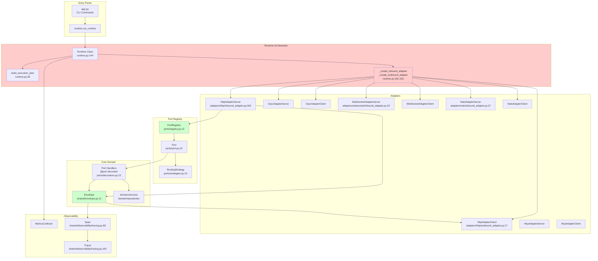
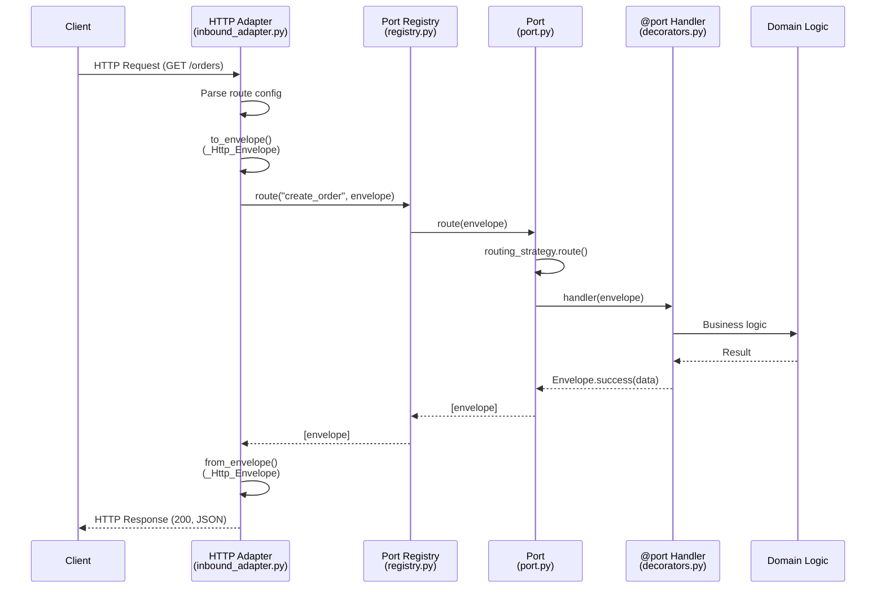
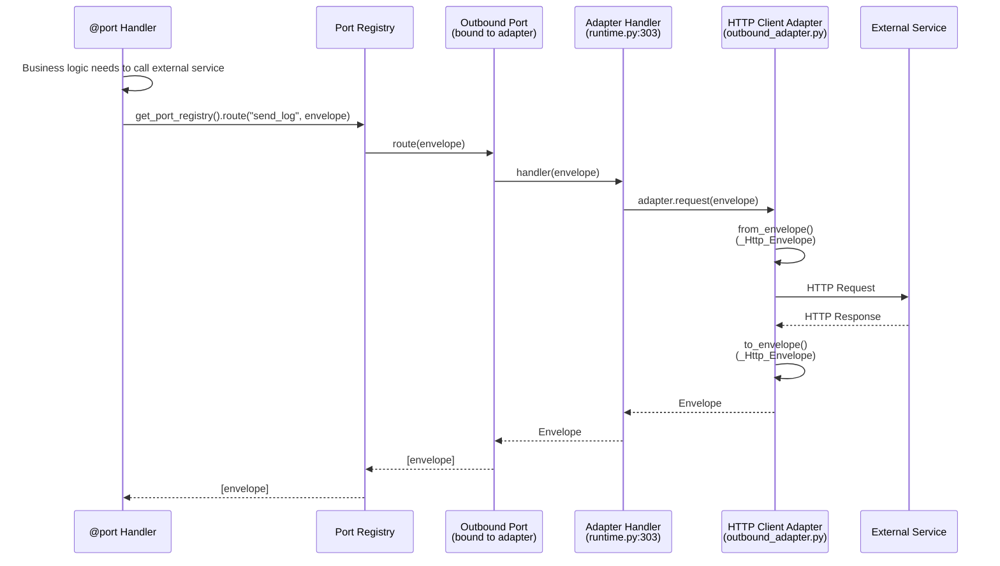

# Refactor Intake Report: HexSwitch Architecture Analysis

**Generated:** 2024  
**Purpose:** Facts-first analysis of current architecture vs. target architecture  
**Status:** Pre-refactoring baseline

---

## Executive Snapshot

**What HexSwitch is:** A hexagonal architecture runtime framework for config-driven microservices that orchestrates protocol adapters (HTTP, gRPC, WebSocket, NATS, MCP) and routes messages through a port-based handler system using an Envelope abstraction.

**Core Abstractions:**
- **Envelope** (`src/hexswitch/shared/envelope.py`): Unified message format with integrated observability (trace context, span management)
- **Ports** (`src/hexswitch/ports/`): Named connection points with routing strategies (FirstStrategy, BroadcastStrategy, RoundRobinStrategy)
- **Adapters** (`src/hexswitch/adapters/`): Protocol converters (HTTP, gRPC, WebSocket, NATS, MCP) - both inbound and outbound
- **Runtime** (`src/hexswitch/runtime.py`): Lifecycle orchestrator that starts/stops adapters and binds them to ports
- **Registry** (`src/hexswitch/ports/registry.py`): Global singleton for port/handler registration

**Key Paths:**
- Runtime: `src/hexswitch/runtime.py` (455 lines)
- Envelope: `src/hexswitch/shared/envelope.py` (241 lines)
- Port Registry: `src/hexswitch/ports/registry.py` (191 lines)
- Adapters: `src/hexswitch/adapters/{http,grpc,websocket,nats,mcp}/`

**Top 5 Architectural Pain Points:**
1. **Runtime knows adapter types**: Runtime has hardcoded adapter factory methods (`_create_inbound_adapter`, `_create_outbound_adapter`) - violates dependency inversion
2. **Mixed concurrency models**: Some adapters use threads (HTTP), others use asyncio (NATS, WebSocket) - no unified execution model
3. **Outbound adapters bound as handlers**: Outbound adapters are registered as port handlers (lines 303-309 in `runtime.py`) - confusing abstraction
4. **No explicit pipeline**: No clear pipeline abstraction - routing happens ad-hoc in adapters and registry
5. **Telemetry propagation gaps**: Trace context in Envelope but not consistently propagated through all adapter boundaries

---

## Current Architecture Map



**Evidence:**
- Entry point: `src/hexswitch/app.py:84` (`cmd_run` → `run_runtime`)
- Runtime initialization: `src/hexswitch/runtime.py:147`
- Adapter creation: `src/hexswitch/runtime.py:181-233` (hardcoded if/elif chains)
- Registry: `src/hexswitch/ports/registry.py:12` (thread-safe singleton)
- Envelope: `src/hexswitch/shared/envelope.py:11` (dataclass with trace fields)

---

## Execution Model & Concurrency

### Current State (Evidence-Based)

**Concurrency Model:** **Mixed** - Both threads and asyncio, no unified model.

**Event Loop:**
- **No global event loop** - Runtime uses blocking `time.sleep(0.1)` loop (`runtime.py:418`)
- **Per-adapter event loops:**
  - NATS: Creates asyncio loop in separate thread (`adapters/nats/inbound_adapter.py:182`)
  - WebSocket: Creates asyncio loop in separate thread (`adapters/websocket/inbound_adapter.py`)
  - HTTP: Uses `threading.Thread` with blocking `HTTPServer` (`adapters/http/inbound_adapter.py:340`)
  - gRPC: Uses `ThreadPoolExecutor` (`adapters/grpc/inbound_adapter.py:235`)

**Adapter Threading:**
- HTTP inbound: `Thread(target=self.server.serve_forever, daemon=True)` (`adapters/http/inbound_adapter.py:340`)
- NATS inbound: `Thread(target=run_loop, daemon=True)` with asyncio (`adapters/nats/inbound_adapter.py:182`)
- WebSocket inbound: `Thread(target=run_server, daemon=True)` with asyncio (`adapters/websocket/inbound_adapter.py`)
- gRPC: `ThreadPoolExecutor(max_workers=10)` (`adapters/grpc/inbound_adapter.py:235`)

**Executor Usage:**
- gRPC only: `ThreadPoolExecutor` for request handling
- No `ProcessPoolExecutor` usage found

**Shutdown Handling:**
- Signal handlers: `signal.signal(signal.SIGINT, signal_handler)` and `signal.SIGTERM` (`runtime.py:445-446`)
- Graceful shutdown: `runtime.stop()` iterates adapters and calls `stop()`/`disconnect()` (`runtime.py:343-405`)
- Thread joining: HTTP adapter joins with timeout (`adapters/http/inbound_adapter.py:366`)
- No explicit cancellation tokens or asyncio cancellation

**Evidence:**
```python
# runtime.py:407-422
def run(self) -> None:
    """Run the runtime event loop (blocking)."""
    while not self._shutdown_requested:
        import time
        time.sleep(0.1)  # Small sleep to avoid busy-waiting
```

**Issues:**
- No unified execution model - adapters manage their own concurrency
- Blocking runtime loop doesn't integrate with asyncio adapters
- No backpressure mechanism visible
- Thread safety: Registry uses `threading.Lock()` (`ports/registry.py:22`)

---

## Envelope / Message Model

### Canonical Message Object

**Envelope** (`src/hexswitch/shared/envelope.py:11`) - Dataclass with integrated observability.

### Field Inventory

| Field | Type | Who Sets It | Where Used | Notes |
|-------|------|-------------|------------|-------|
| `path` | `str` | Adapter (from protocol) | Routing, span tags | Required |
| `method` | `str \| None` | Adapter (HTTP only) | HTTP adapter conversion | Optional, HTTP-specific |
| `path_params` | `dict[str, str]` | Adapter (route parsing) | Handler access | Default: `{}` |
| `query_params` | `dict[str, Any]` | Adapter (URL parsing) | Handler access | Default: `{}` |
| `headers` | `dict[str, str]` | Adapter (protocol headers) | Handler, response | Default: `{}` |
| `body` | `dict[str, Any] \| None` | Adapter (parsed request) | Handler access | Optional |
| `status_code` | `int` | Handler/Adapter | Response conversion | Default: 200 |
| `data` | `dict[str, Any] \| None` | Handler | Response conversion | Success response |
| `error_message` | `str \| None` | Handler/Adapter | Response conversion | Error response |
| `metadata` | `dict[str, Any]` | Adapter | Protocol-specific data | Default: `{}` |
| `trace_id` | `str \| None` | Adapter/Observability | Trace propagation | Auto-set by adapters |
| `span_id` | `str \| None` | Adapter/Observability | Span hierarchy | Auto-set by adapters |
| `parent_span_id` | `str \| None` | Adapter/Observability | Span hierarchy | Auto-set by adapters |
| `_span` | `Span \| None` | Envelope.start_span() | Observability | Internal, not serialized |

**Evidence:**
- Definition: `src/hexswitch/shared/envelope.py:11-64`
- Factory methods: `Envelope.success()` (line 67), `Envelope.error()` (line 87)
- Observability integration: `envelope.start_span()` (line 108), `envelope.finish_span()` (line 158)

### Trace Context Fields

**Required/Optional:**
- `trace_id`: Optional - set by adapters when extracting from protocol headers
- `span_id`: Optional - set by adapters or `start_span()`
- `parent_span_id`: Optional - set for child spans

**Error Representation:**
- `error_message`: String field in Envelope
- `status_code`: HTTP-style status codes (400, 404, 500, etc.)
- Factory: `Envelope.error(status_code, error_message)` (`shared/envelope.py:87`)

**Request/Response Correlation:**
- **No explicit correlation ID field** - relies on trace_id/span_id
- Outbound adapters preserve `original_envelope` in some converters (`adapters/http/outbound_adapter.py:96`)

**Serialization/Codec:**
- **No built-in serialization** - adapters handle protocol-specific serialization
- HTTP: JSON via `json.dumps()` (`adapters/http/inbound_adapter.py:275`)
- Envelope is Python-native (dataclass) - not serialized directly

---

## Routing & Handler Registration

### Handler Discovery/Registration

**Mechanism:** Decorator-based registration via `@port(name)` (`ports/decorators.py:12`).

**Process:**
1. Handler function decorated with `@port(name="port_name")`
2. Decorator calls `get_port_registry().register_handler(name, wrapper, routing)` (`ports/decorators.py:56`)
3. Registry creates `Port` if not exists, adds handler to port's handler list (`ports/registry.py:24-55`)
4. Handlers imported via `import hexswitch.handlers` (`runtime.py:23`) - ensures registration

**Evidence:**
```python
# ports/decorators.py:43-59
def decorator(func: Callable) -> Callable:
    wrapper._port_name = name
    wrapper._routing_strategy = routing
    registry.register_handler(name, wrapper, routing)
    return wrapper
```

**Alternative Registration:**
- **Config-driven handler paths**: Adapters support `handler: "module.path:function_name"` in config (`adapters/http/inbound_adapter.py:209-218`)
- **Port references**: Adapters support `port: "port_name"` in config (`adapters/http/inbound_adapter.py:207`)

### Outbound "Send" Operations

**Current Model:** Outbound adapters are **registered as port handlers** (`runtime.py:303-309`).

**Process:**
1. Runtime creates outbound adapter (`runtime.py:288`)
2. Adapter connects (`runtime.py:291`)
3. Runtime reads `ports: ["port_name"]` from adapter config (`runtime.py:296`)
4. Runtime creates handler wrapper that calls `adapter.request(envelope)` (`runtime.py:303-306`)
5. Handler registered on port via `port_registry.register_handler(port_name, handler)` (`runtime.py:309`)

**Evidence:**
```python
# runtime.py:303-309
def create_adapter_handler(adapter_instance: OutboundAdapter):
    def handler(envelope):
        return adapter_instance.request(envelope)
    return handler
handler = create_adapter_handler(adapter)
port_registry.register_handler(port_name, handler)
```

**Issues:**
- Outbound adapters masquerade as handlers - confusing abstraction
- No explicit "emit" API - handlers must know port names
- No routing table for outbound targets

### Routing Mechanism

**How Routing Works:**
1. **Port name matching**: Adapter routes to port by exact name (`ports/registry.py:57`)
2. **Routing strategies**: Port uses `RoutingStrategy` to select handlers:
   - `FirstStrategy`: Calls first handler only (`ports/strategies.py:27`)
   - `BroadcastStrategy`: Calls all handlers, collects results (`ports/strategies.py:44`)
   - `RoundRobinStrategy`: Round-robin selection (`ports/strategies.py:74`)
3. **Handler execution**: Strategy calls handler with envelope, returns list of envelopes (`ports/port.py:27-43`)

**Config Influence:**
- **Adapter-level routing**: Adapters have `routes` config with `path`/`method`/`port` mappings (`adapters/http/inbound_adapter.py:320`)
- **No global routing table** - routing is adapter-specific
- **No wildcard/regex patterns** - HTTP adapter supports path params (`:id`) via regex (`adapters/http/inbound_adapter.py:185-197`)

**Evidence:**
```python
# adapters/http/inbound_adapter.py:174-197
for r in self.routes:
    if r["method"].upper() != method.upper():
        continue
    route_path = r["path"]
    if route_path == request_path:
        route = r
        break
    # Path parameter matching with regex
    if ":" in route_path:
        pattern = re.sub(r":(\w+)", r"([^/]+)", route_path)
        regex = re.compile(f"^{pattern}$")
        if regex.match(request_path):
            route = r
            break
```

### Sequence Diagrams

#### Inbound Flow (HTTP Example)



**Evidence:**
- HTTP adapter: `adapters/http/inbound_adapter.py:151-263`
- Registry routing: `ports/registry.py:57-83`
- Port routing: `ports/port.py:27-43`

#### Outbound Flow (HTTP Client Example)



**Evidence:**
- Outbound binding: `runtime.py:294-312`
- HTTP client: `adapters/http/outbound_adapter.py:111-162`

---

## Adapter Inventory

| Adapter | Direction | Protocol | Files | Key Entry Methods | Notes (ack/retry/backpressure) |
|---------|-----------|----------|-------|-------------------|--------------------------------|
| **HTTP Server** | Inbound | HTTP/1.1 | `adapters/http/inbound_adapter.py` | `start()`, `to_envelope()`, `from_envelope()` | No ack, no retry, blocking threads |
| **HTTP Client** | Outbound | HTTP/1.1 | `adapters/http/outbound_adapter.py` | `connect()`, `request(envelope)` | No ack, no retry, sync requests |
| **FastAPI** | Inbound | HTTP/1.1 (async) | `adapters/http/fastapi_adapter.py` | `start()`, async handlers | No ack, no retry, asyncio-based |
| **gRPC Server** | Inbound | gRPC | `adapters/grpc/inbound_adapter.py` | `start()`, `_handle_request()` | No ack, no retry, ThreadPoolExecutor |
| **gRPC Client** | Outbound | gRPC | `adapters/grpc/outbound_adapter.py` | `connect()`, `request(envelope)` | No ack, no retry, sync calls |
| **WebSocket Server** | Inbound | WebSocket | `adapters/websocket/inbound_adapter.py` | `start()`, `_handle_connection()` | No ack, connection-based, asyncio |
| **WebSocket Client** | Outbound | WebSocket | `adapters/websocket/outbound_adapter.py` | `connect()`, `request(envelope)` | No ack, connection-based, asyncio |
| **NATS Server** | Inbound | NATS | `adapters/nats/inbound_adapter.py` | `start()`, `_handle_message()` | **Ack support** (manual ack), no retry, asyncio |
| **NATS Client** | Outbound | NATS | `adapters/nats/outbound_adapter.py` | `connect()`, `request(envelope)` | **Request-reply** (correlation), no retry, asyncio |
| **MCP Server** | Inbound | MCP | `adapters/mcp/inbound_adapter.py` | `start()`, message handling | No ack, no retry, threading |
| **MCP Client** | Outbound | MCP | `adapters/mcp/outbound_adapter.py` | `connect()`, `request(envelope)` | No ack, no retry, sync |

### Bidirectional Adapters

**WebSocket** (`adapters/websocket/`):
- **Bidirectional**: Server maintains connections, can send/receive (`adapters/websocket/inbound_adapter.py:80-203`)
- **Correlation**: Connection-based (no explicit correlation ID)
- **Evidence**: `_handle_connection()` handles both directions

**NATS** (`adapters/nats/`):
- **Request-Reply**: Client supports request-reply pattern (`adapters/nats/outbound_adapter.py`)
- **Correlation**: Uses NATS reply subjects for correlation
- **Evidence**: `request()` method uses reply subject (`adapters/nats/outbound_adapter.py`)

**Note:** No true bidirectional adapter abstraction - WebSocket and NATS implement bidirectional behavior in their specific adapters.

---

## Telemetry & Observability

### Tracing

**Initialization:**
- Global tracer: `get_global_tracer()` (`shared/observability/tracing.py:238`)
- TracerProvider: OpenTelemetry SDK (`shared/observability/tracing.py:67-80`)
- Span exporter: `SafeConsoleSpanExporter` (console output) (`shared/observability/tracing.py:32`)

**Context Propagation:**
- **Envelope fields**: `trace_id`, `span_id`, `parent_span_id` (`shared/envelope.py:59-61`)
- **Span creation**: `envelope.start_span()` creates span and updates envelope fields (`shared/envelope.py:108-156`)
- **Adapter extraction**: Adapters should extract trace context from protocol headers (not consistently implemented)
- **Propagation**: Trace context stored in Envelope, but not always extracted/propagated by adapters

**Naming Conventions:**
- Runtime spans: `"runtime.start"`, `"runtime.stop"`, `"adapter.start"`, `"adapter.stop"` (`runtime.py:243, 345`)
- Envelope spans: Uses `envelope.path` or `"envelope"` as name (`shared/envelope.py:121`)

**Evidence:**
```python
# shared/envelope.py:108-156
def start_span(self, name: str | None = None, tags: dict[str, str] | None = None) -> Span:
    span_name = name or self.path or "envelope"
    span = start_span(span_name, parent=parent_span, tags=span_tags)
    self.trace_id = span.trace_id
    self.span_id = span.span_id
```

### Metrics

**Initialization:**
- Global metrics: `get_global_metrics_collector()` (`shared/observability/`)
- Runtime metrics: Counters, gauges, histograms (`runtime.py:164-170`)
  - `runtime_adapter_starts_total`
  - `runtime_adapter_stops_total`
  - `runtime_adapter_errors_total`
  - `runtime_active_adapters`
  - `runtime_adapter_start_duration_seconds`

**Propagation:**
- Metrics collected at runtime level, not per-envelope
- No metrics in Envelope itself

**Naming:**
- Prometheus-style: `runtime_adapter_starts_total` (`runtime.py:164`)

### Logging

**Initialization:**
- `setup_logging()` (`shared/logging/`)
- Logger: `get_logger(__name__)` pattern

**Context Propagation:**
- **No correlation ID in logs** - relies on trace_id (not consistently added to log context)
- Logging happens at adapter/handler level, not envelope-level

**Naming:**
- Module-based: `logging.getLogger(__name__)`

### Cross-Boundary Consistency

**Issues:**
- **Trace context not consistently extracted**: HTTP adapter doesn't extract trace headers (W3C Trace Context)
- **Span creation ad-hoc**: Some adapters create spans, others don't
- **No envelope-level metrics**: Metrics only at runtime level
- **Logging not correlated**: Logs don't include trace_id/correlation_id

**Evidence:**
- HTTP adapter: No trace header extraction visible (`adapters/http/inbound_adapter.py:246`)
- Envelope has trace fields but adapters don't always populate them

---

## Configuration & Dynamic Wiring

### Config Loading

**Mechanism:** YAML file loading (`shared/config/config.py:20-60`).

**Process:**
1. Load YAML: `load_config(config_path)` (`shared/config/config.py:20`)
2. Validate: `validate_config(config)` using Pydantic models (`shared/config/config.py:63`)
3. Default path: `hex-config.yaml` (`shared/config/config.py:11`)

**Evidence:**
```python
# shared/config/config.py:20-60
def load_config(config_path: str | Path | None = None) -> dict[str, Any]:
    config_path = Path(config_path or DEFAULT_CONFIG_PATH)
    with config_path.open("r", encoding="utf-8") as f:
        content = f.read()
    config = yaml.safe_load(content)
    return config
```

### Runtime Registration

**Current State:** **No runtime registration** - all adapters/handlers registered at startup.

**Process:**
1. Config loaded at startup (`app.py:97`)
2. Runtime builds execution plan (`runtime.py:247`)
3. Adapters created and started (`runtime.py:250-327`)
4. Handlers registered via decorators at import time (`runtime.py:23`)

**Hot Reload:** **Not supported** - no config reload mechanism.

### Configurable Elements

**What is Configurable:**
- **Adapters**: Enabled/disabled, port numbers, URLs, subjects, routes (`runtime.py:54-105`)
- **Routes**: HTTP routes with path/method/port mappings (`adapters/http/inbound_adapter.py:320`)
- **Port bindings**: Outbound adapters bound to ports via `ports: ["port_name"]` (`runtime.py:296`)
- **Routing strategies**: Per-port routing strategy (FirstStrategy, BroadcastStrategy, RoundRobinStrategy) (`ports/decorators.py:14`)

**What is NOT Configurable:**
- Handler implementations (must be code)
- Routing table (adapter-specific, not global)
- Codecs (hardcoded in adapter converters)
- Retry/backpressure policies (not implemented)

### Example Config Structure

**Inferred from code:**
```yaml
service:
  name: "my-service"
  gui:
    enabled: false

inbound:
  http:
    enabled: true
    port: 8000
    base_path: ""
    routes:
      - path: "/orders"
        method: "GET"
        port: "list_orders"
      - path: "/orders/:id"
        method: "GET"
        port: "get_order"

outbound:
  http_client:
    enabled: true
    base_url: "https://api.example.com"
    ports: ["send_log", "external_api"]
    timeout: 30
```

**Evidence:**
- Config structure: `runtime.py:38-105` (execution plan building)
- HTTP routes: `adapters/http/inbound_adapter.py:320`
- Outbound ports: `runtime.py:296`

---

## "Core Boundary" Audit

### What Core Knows (Should NOT Know)

**Core imports adapters:** ❌ **YES** - Runtime imports all adapter classes (`runtime.py:8-12`)

```python
# runtime.py:8-12
from hexswitch.adapters.grpc import GrpcAdapterClient, GrpcAdapterServer
from hexswitch.adapters.http import FastApiHttpAdapterServer, HttpAdapterClient
from hexswitch.adapters.mcp import McpAdapterClient, McpAdapterServer
from hexswitch.adapters.nats import NatsAdapterClient, NatsAdapterServer
from hexswitch.adapters.websocket import WebSocketAdapterClient, WebSocketAdapterServer
```

**Core imports protocol libs:** ❌ **YES** - Runtime doesn't directly, but adapters do (httpx, nats, websockets, grpc)

**Domain logic location:**
- `src/hexswitch/domain/services/` - Domain services
- `src/hexswitch/domain/repositories/` - Repository interfaces
- **No domain logic in adapters** ✅ (adapters are converters)

**IO location:**
- `src/hexswitch/adapters/` - All I/O (HTTP, gRPC, WebSocket, NATS, MCP)
- **IO separated from domain** ✅

### Boundary Violations vs. Target Model

| Violation | Target Expects | Current Code Does | Why It Matters | Code Reference | Refactor Direction |
|-----------|----------------|-------------------|----------------|----------------|-------------------|
| **Runtime knows adapter types** | Runtime should use adapter registry/factory pattern | Runtime has hardcoded `if/elif` chains for adapter creation | Violates dependency inversion, makes adding adapters require runtime changes | `runtime.py:181-233` | Extract adapter factory/registry, use plugin pattern |
| **Outbound adapters as handlers** | Outbound should be explicit `runtime.emit()` API | Outbound adapters registered as port handlers | Confusing abstraction, handlers don't know they're calling adapters | `runtime.py:303-309` | Create `runtime.emit(port_name, envelope)` API |
| **No explicit pipeline** | Pipeline abstraction for envelope flow | Routing happens ad-hoc in adapters/registry | Hard to add middleware, backpressure, retry logic | `adapters/http/inbound_adapter.py:256`, `ports/registry.py:57` | Create `Pipeline` class with stages |
| **Telemetry not consistently propagated** | Trace context in Envelope, propagated through all boundaries | Adapters don't always extract/populate trace context | Broken distributed tracing | `adapters/http/inbound_adapter.py:246` (no trace extraction) | Add trace extraction to all adapters |
| **Mixed concurrency models** | Unified execution model (asyncio or threads) | Some adapters use threads, others asyncio | Hard to coordinate, no backpressure | `adapters/http/inbound_adapter.py:340` (threads), `adapters/nats/inbound_adapter.py:182` (asyncio) | Standardize on asyncio or add unified executor |

**Evidence:**
- Adapter imports: `runtime.py:8-12`
- Adapter factory: `runtime.py:181-233`
- Outbound binding: `runtime.py:303-309`

---

## Critical Flows (Top 3)

### Flow 1: HTTP Inbound Request → Handler → Response

**Trigger:** HTTP GET request to `/orders`

**Step-by-Step:**
1. **HTTP Adapter receives request** (`adapters/http/inbound_adapter.py:131` - `do_GET()`)
2. **Route matching** (`adapters/http/inbound_adapter.py:174-197` - finds route config)
3. **Handler/port resolution** (`adapters/http/inbound_adapter.py:204-228` - loads handler from port or module)
4. **Envelope creation** (`adapters/http/inbound_adapter.py:246` - `to_envelope()`)
5. **Handler invocation** (`adapters/http/inbound_adapter.py:257` - `handler(request_envelope)`)
6. **Port routing** (if port-based: `ports/registry.py:57` → `ports/port.py:27` → handler)
7. **Response envelope** (handler returns `Envelope.success(data)`)
8. **HTTP response** (`adapters/http/inbound_adapter.py:263` - `from_envelope()`)

**Message Transformations:**
- HTTP Request → `HttpEnvelope.request_to_envelope()` → `Envelope`
- `Envelope` → Handler → `Envelope` (same instance or new)
- `Envelope` → `HttpEnvelope.envelope_to_response()` → HTTP Response

**Telemetry Points:**
- **No automatic span creation** in HTTP adapter
- Handler can call `envelope.start_span()` manually
- Runtime creates spans for adapter start/stop (`runtime.py:251`)

**Failure Modes:**
- Route not found: 404 response (`adapters/http/inbound_adapter.py:200`)
- Handler error: 500 response, exception caught (`adapters/http/inbound_adapter.py:258-260`)
- **No retry** - single attempt
- **No ack** - HTTP is request-response

**Evidence:**
- HTTP handler: `adapters/http/inbound_adapter.py:151-263`
- Envelope conversion: `adapters/http/_Http_Envelope.py` (referenced but not shown)

### Flow 2: Handler → Outbound Adapter → External Service

**Trigger:** Handler calls port bound to outbound adapter

**Step-by-Step:**
1. **Handler creates envelope** (e.g., `Envelope(path="/api/log", method="POST", body={...})`)
2. **Handler routes to port** (`ports/registry.py:57` - `route("send_log", envelope)`)
3. **Port routes to adapter handler** (`ports/port.py:27` - adapter was registered as handler)
4. **Adapter handler calls adapter** (`runtime.py:305` - `adapter_instance.request(envelope)`)
5. **HTTP client converts envelope** (`adapters/http/outbound_adapter.py:129` - `from_envelope()`)
6. **HTTP request** (`adapters/http/outbound_adapter.py:136` - `session.request()`)
7. **HTTP response** (`adapters/http/outbound_adapter.py:148` - parse JSON)
8. **Response envelope** (`adapters/http/outbound_adapter.py:152` - `to_envelope()`)
9. **Return to handler** (envelope propagated back)

**Message Transformations:**
- `Envelope` → `HttpEnvelope.envelope_to_request()` → HTTP Request
- HTTP Response → `HttpEnvelope.response_to_envelope()` → `Envelope`

**Telemetry Points:**
- **No automatic span creation** for outbound calls
- Trace context in envelope not propagated to HTTP headers (W3C Trace Context)

**Failure Modes:**
- Connection error: `requests.RequestException` caught, returns `Envelope.error(500, str(e))` (`adapters/http/outbound_adapter.py:158-162`)
- **No retry** - single attempt
- **No circuit breaker** - no failure tracking

**Evidence:**
- Outbound binding: `runtime.py:303-309`
- HTTP client: `adapters/http/outbound_adapter.py:111-162`

### Flow 3: NATS Message → Handler (Async)

**Trigger:** NATS message on subject `orders.create`

**Step-by-Step:**
1. **NATS adapter receives message** (`adapters/nats/inbound_adapter.py` - async message handler)
2. **Subject → handler mapping** (`adapters/nats/inbound_adapter.py:58-100` - loads handlers from config)
3. **Envelope creation** (`adapters/nats/_Nats_Envelope.py` - converts NATS message)
4. **Handler invocation** (async handler called with envelope)
5. **Port routing** (if port-based: registry lookup)
6. **Response** (handler returns envelope, NATS may ack)

**Message Transformations:**
- NATS Message → `NatsEnvelope` → `Envelope`
- `Envelope` → Handler → `Envelope`

**Telemetry Points:**
- **No automatic span creation** visible
- Async execution in separate event loop

**Failure Modes:**
- Handler error: Exception caught, error envelope returned
- **Manual ack** - NATS adapter supports ack (`adapters/nats/inbound_adapter.py` - ack mentioned but not shown in excerpt)
- **No retry** - single attempt per message

**Evidence:**
- NATS adapter: `adapters/nats/inbound_adapter.py:27-100`
- Async loop: `adapters/nats/inbound_adapter.py:182`

---

## Tests & Safety Nets

### Test Coverage

**Unit Tests:**
- Location: `tests/unit/`
- Coverage: Adapters, ports, envelope, runtime, handlers, observability
- Examples:
  - `tests/unit/adapters/http/` - HTTP adapter tests
  - `tests/unit/ports/` - Port registry tests
  - `tests/unit/runtime/` - Runtime tests

**Integration Tests:**
- Location: `tests/integration/`
- Tests:
  - `test_e2e_complete.py` - End-to-end flows
  - `test_hello_world.py` - Basic functionality
  - `test_multi_adapter.py` - Multiple adapters
  - `test_observability_stress.py` - Observability under load
  - `test_runtime_execution.py` - Runtime lifecycle

**Test Execution:**
```bash
pytest                    # All tests
pytest tests/unit/        # Unit tests only
pytest tests/integration/ # Integration tests only
pytest --cov=src/hexswitch --cov-report=html  # With coverage
```

**Evidence:**
- Test structure: `tests/unit/`, `tests/integration/`
- Coverage report: `coverage_report.txt`, `coverage.xml` (in repo)

### Lint/Type Tooling

**Tools:**
- **ruff**: Linting (`pyproject.toml` - likely configured)
- **mypy**: Type checking (if configured)
- **pytest**: Testing framework

**CI Pipelines:**
- `.github/workflows/ci.yaml` - CI workflow (107 lines)
- `.github/workflows/cd.yaml` - CD workflow (180 lines)

**Evidence:**
- CI config: `.github/workflows/ci.yaml`
- Project config: `pyproject.toml`

### "Must Not Break" Invariants

**Inferred from code:**
1. **Port registry thread-safety**: Registry uses `threading.Lock()` - must remain thread-safe
2. **Envelope immutability**: Envelope is dataclass - handlers should not mutate input envelope (return new)
3. **Adapter lifecycle**: `start()` → `stop()` sequence must be idempotent
4. **Handler signature**: Handlers must accept `Envelope` and return `Envelope | None`
5. **Port registration**: Handlers registered via `@port` decorator at import time
6. **Config validation**: Config must pass Pydantic validation before runtime starts

---

## Delta vs Target Model

### Critical Mismatches

#### 1. Runtime Knows Adapter Types

**Target:** Runtime should not know specific adapter types - use adapter registry/factory pattern.

**Current:** Runtime has hardcoded `if/elif` chains:
```python
# runtime.py:181-205
if name == "http":
    return FastApiHttpAdapterServer(name, adapter_config)
elif name == "grpc":
    return GrpcAdapterServer(name, adapter_config)
# ... etc
```

**Why It Matters:** Adding new adapters requires modifying runtime. Violates Open/Closed Principle.

**Code Reference:** `src/hexswitch/runtime.py:181-233`

**Refactor Direction:** Extract adapter factory/registry, use plugin pattern or discovery mechanism.

---

#### 2. Outbound Adapters as Handlers

**Target:** Outbound should be explicit `runtime.emit(port_name, envelope)` API, not handlers.

**Current:** Outbound adapters registered as port handlers:
```python
# runtime.py:303-309
def create_adapter_handler(adapter_instance: OutboundAdapter):
    def handler(envelope):
        return adapter_instance.request(envelope)
    return handler
port_registry.register_handler(port_name, handler)
```

**Why It Matters:** Confusing abstraction - handlers don't know they're calling adapters. No explicit routing table.

**Code Reference:** `src/hexswitch/runtime.py:294-312`

**Refactor Direction:** Create `Runtime.emit(port_name, envelope)` method, maintain outbound routing table separate from handler registry.

---

#### 3. No Explicit Pipeline

**Target:** Pipeline abstraction for envelope flow with stages (validation, transformation, routing, telemetry).

**Current:** Routing happens ad-hoc:
- Adapters call registry directly (`adapters/http/inbound_adapter.py:257`)
- Registry routes to port (`ports/registry.py:57`)
- No pipeline stages

**Why It Matters:** Hard to add middleware, backpressure, retry logic, request/response transformation.

**Code Reference:** `adapters/http/inbound_adapter.py:256`, `ports/registry.py:57`

**Refactor Direction:** Create `Pipeline` class with stages (inbound: adapter → validate → route → handler → transform → adapter; outbound: handler → route → transform → adapter).

---

#### 4. Telemetry Not Consistently Propagated

**Target:** Trace context in Envelope, propagated through all adapter boundaries (extract from protocol headers, inject into protocol headers).

**Current:** 
- Envelope has trace fields (`shared/envelope.py:59-61`)
- Adapters don't consistently extract trace headers (HTTP adapter doesn't extract W3C Trace Context)
- Adapters don't inject trace headers in outbound requests

**Why It Matters:** Broken distributed tracing - trace context lost at adapter boundaries.

**Code Reference:** `adapters/http/inbound_adapter.py:246` (no trace extraction), `adapters/http/outbound_adapter.py:129` (no trace injection)

**Refactor Direction:** Add trace extraction to all inbound adapters (W3C Trace Context, B3, etc.), add trace injection to all outbound adapters.

---

#### 5. Mixed Concurrency Models

**Target:** Unified execution model (asyncio or threads) with consistent backpressure.

**Current:**
- HTTP: Threads (`adapters/http/inbound_adapter.py:340`)
- NATS: Asyncio in thread (`adapters/nats/inbound_adapter.py:182`)
- WebSocket: Asyncio in thread (`adapters/websocket/inbound_adapter.py`)
- gRPC: ThreadPoolExecutor (`adapters/grpc/inbound_adapter.py:235`)
- Runtime: Blocking loop (`runtime.py:418`)

**Why It Matters:** Hard to coordinate, no unified backpressure, can't use asyncio features (cancellation, backpressure).

**Code Reference:** `runtime.py:418`, `adapters/http/inbound_adapter.py:340`, `adapters/nats/inbound_adapter.py:182`

**Refactor Direction:** Standardize on asyncio (preferred) or add unified executor abstraction.

---

#### 6. No Config-Driven Routing

**Target:** Routing table configurable at runtime, can be updated without code changes.

**Current:**
- Routing is adapter-specific (HTTP routes in HTTP adapter config)
- No global routing table
- Port names hardcoded in handlers/decorators

**Why It Matters:** Can't change routing without code changes or adapter config changes.

**Code Reference:** `adapters/http/inbound_adapter.py:320` (routes in adapter config), `ports/decorators.py:12` (port names in code)

**Refactor Direction:** Create global routing table in config, support runtime updates.

---

#### 7. Core Imports Adapters

**Target:** Core (runtime) should not import adapter implementations - use abstractions.

**Current:** Runtime imports all adapter classes:
```python
# runtime.py:8-12
from hexswitch.adapters.grpc import GrpcAdapterClient, GrpcAdapterServer
from hexswitch.adapters.http import FastApiHttpAdapterServer, HttpAdapterClient
# ... etc
```

**Why It Matters:** Violates dependency inversion - runtime depends on concrete adapters.

**Code Reference:** `src/hexswitch/runtime.py:8-12`

**Refactor Direction:** Runtime should only know `InboundAdapter` and `OutboundAdapter` base classes, use factory/registry for instantiation.

---

### What Already Matches Target

✅ **Adapters as converters**: Adapters convert Protocol ↔ Envelope (`adapters/http/inbound_adapter.py:372-412`)

✅ **Envelope-first**: All handlers use Envelope (`ports/decorators.py:30`)

✅ **Port-based routing**: Ports separate adapters from handlers (`ports/port.py:10`)

✅ **Telemetry in Envelope**: Envelope has trace context fields (`shared/envelope.py:59-61`)

✅ **Domain logic separated**: Domain logic in `domain/` directory, not in adapters

---

## Refactor Readiness Checklist

### Biggest Coupling Points (Top 5)

1. **Runtime → Adapter Classes** (`runtime.py:8-12`): Runtime imports all adapter implementations
2. **Adapters → Port Registry** (`adapters/http/inbound_adapter.py:14`): Adapters directly call registry
3. **Outbound → Handler Registry** (`runtime.py:309`): Outbound adapters registered as handlers
4. **Envelope → Observability** (`shared/envelope.py:7`): Envelope imports tracing directly
5. **Config → Adapter Types** (implicit): Config structure assumes adapter types

### Most Dangerous Modules to Touch

1. **`ports/registry.py`**: Thread-safe singleton, used everywhere
2. **`shared/envelope.py`**: Core data structure, used by all adapters/handlers
3. **`runtime.py`**: Lifecycle orchestration, touches all adapters
4. **`adapters/base.py`**: Base classes, changes affect all adapters

### Quick Wins (Safe Refactors) vs Risky Refactors

**Quick Wins:**
- ✅ Extract adapter factory from runtime (create `AdapterFactory` class)
- ✅ Add trace extraction to HTTP adapter (W3C Trace Context)
- ✅ Create `Runtime.emit()` method (wrapper around current outbound handler pattern)
- ✅ Standardize adapter error handling (common exception types)

**Risky Refactors:**
- ⚠️ Unify concurrency model (asyncio migration) - breaks all adapters
- ⚠️ Extract pipeline abstraction - changes all adapter interfaces
- ⚠️ Remove runtime adapter imports - requires factory/registry refactor
- ⚠️ Config-driven routing - changes handler registration model

### Suggested Refactor Order (High-Level)

1. **Phase 1: Adapter Factory** - Extract adapter creation from runtime
2. **Phase 2: Telemetry Propagation** - Add trace extraction/injection to all adapters
3. **Phase 3: Outbound API** - Create `Runtime.emit()` API, separate from handler registry
4. **Phase 4: Pipeline Abstraction** - Add pipeline stages (validation, transformation, routing)
5. **Phase 5: Concurrency Unification** - Standardize on asyncio (or unified executor)
6. **Phase 6: Config-Driven Routing** - Move routing table to config, support runtime updates

---

## Specific Questions Answered

### What is the single canonical pipeline today?

**Answer:** There is **no single canonical pipeline**. Flow is:
1. Adapter receives protocol message
2. Adapter converts to Envelope (`to_envelope()`)
3. Adapter calls registry/port directly (`get_port_registry().route()` or `get_handler()`)
4. Port routes to handler(s) via strategy
5. Handler returns Envelope
6. Adapter converts Envelope to protocol (`from_envelope()`)
7. Adapter sends protocol response

**Evidence:** `adapters/http/inbound_adapter.py:246-263`

---

### Where is routing defined and how can it be made config-driven?

**Answer:** Routing is **adapter-specific**:
- HTTP: Routes in adapter config (`adapters/http/inbound_adapter.py:320` - `routes` list)
- NATS: Subjects in adapter config (`adapters/nats/inbound_adapter.py:50` - `subjects` list)
- Port names: Hardcoded in `@port` decorators (`ports/decorators.py:12`)

**To make config-driven:**
- Move routing table to global config (not adapter-specific)
- Support port name mapping in config (e.g., `"/orders" → "list_orders"`)
- Allow runtime registration of routes

**Evidence:** `adapters/http/inbound_adapter.py:174-197` (route matching), `ports/decorators.py:12` (port names in code)

---

### How does telemetry propagate from inbound → core → outbound?

**Answer:** **Partially implemented, not consistent:**

1. **Inbound**: Adapters should extract trace context from protocol headers (not consistently done)
2. **Envelope**: Trace context stored in `envelope.trace_id`, `envelope.span_id`, `envelope.parent_span_id`
3. **Core**: Handlers can call `envelope.start_span()` to create child spans
4. **Outbound**: Adapters should inject trace context into protocol headers (not consistently done)

**Gaps:**
- HTTP adapter doesn't extract W3C Trace Context headers
- HTTP client doesn't inject trace headers
- No automatic span creation at adapter boundaries

**Evidence:** `shared/envelope.py:59-61` (trace fields), `adapters/http/inbound_adapter.py:246` (no trace extraction)

---

### What parts already match the desired model?

**Answer:**
- ✅ **Adapters as converters**: Adapters convert Protocol ↔ Envelope (`adapters/http/inbound_adapter.py:372-412`)
- ✅ **Envelope-first**: All handlers use Envelope (`ports/decorators.py:30`)
- ✅ **Port-based routing**: Ports separate adapters from handlers (`ports/port.py:10`)
- ✅ **Telemetry in Envelope**: Envelope has trace context fields (`shared/envelope.py:59-61`)
- ✅ **Domain logic separated**: Domain logic in `domain/` directory

---

### What are the top 3 refactor constraints?

**Answer:**
1. **Backward compatibility**: Existing handlers use `@port` decorator - must continue to work
2. **Minimal change**: Adapters are working - avoid breaking changes
3. **Performance**: Current blocking/threading model works - asyncio migration must not degrade performance

---

## Appendix: Code References Summary

| Component | Key Files | Lines of Code |
|-----------|-----------|---------------|
| Runtime | `src/hexswitch/runtime.py` | 455 |
| Envelope | `src/hexswitch/shared/envelope.py` | 241 |
| Port Registry | `src/hexswitch/ports/registry.py` | 191 |
| Port Decorator | `src/hexswitch/ports/decorators.py` | 62 |
| HTTP Inbound | `src/hexswitch/adapters/http/inbound_adapter.py` | 414 |
| HTTP Outbound | `src/hexswitch/adapters/http/outbound_adapter.py` | 164 |
| NATS Inbound | `src/hexswitch/adapters/nats/inbound_adapter.py` | 267 |
| WebSocket Inbound | `src/hexswitch/adapters/websocket/inbound_adapter.py` | 303 |
| Tracing | `src/hexswitch/shared/observability/tracing.py` | 308 |
| Config | `src/hexswitch/shared/config/config.py` | 994 |
| App/CLI | `src/hexswitch/app.py` | 203 |

---

**End of Report**
