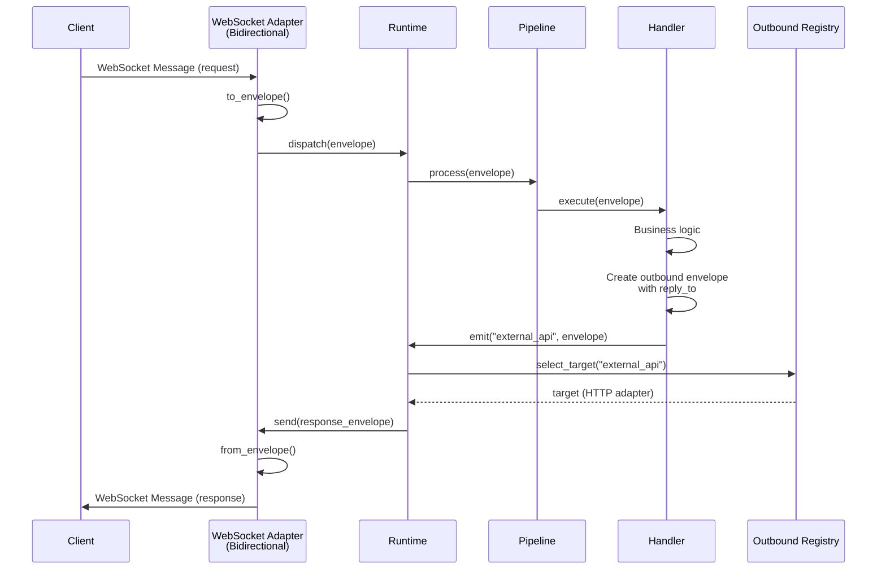

# HexSwitch Refactor Target Architecture & Plan

**Erstellt:** 2024  
**Zweck:** Target-Architektur-Spezifikation und phasierter Refactor-Plan  
**Status:** Vor-Refactoring Planung

---

## 1) Executive Summary

### Was ändert sich (in einem Absatz)

HexSwitch wird von einer Runtime-zentrierten Architektur mit direkten Adapter-Imports zu einer Pipeline-zentrierten Architektur mit klaren Boundaries transformiert. Der Core kennt nur Ports und Handler, die Runtime orchestriert eine kanonische Pipeline mit Middleware für Observability, Routing und Policies. Adapter werden über ein Factory/Plugin-System geladen, nicht mehr direkt importiert. Envelope wird zu einer reinen Datenstruktur ohne Observability-Methoden. Outbound-Adapter werden nicht mehr als Handler registriert, sondern über eine explizite `Runtime.emit()` API aufgerufen. Die Pipeline ermöglicht konfigurationsgetriebenes Routing, Retry-Policies, Backpressure und konsistente Telemetrie-Propagation.

### 5 "Big Moves"

1. **Pipeline-Abstraktion**: Einführung einer kanonischen Pipeline mit definierten Stages (Ingress → Validation → Routing → Handler → Transformation → Egress), die Middleware für Observability, Retry, Backpressure und Transformation unterstützt.

2. **Adapter Factory/Plugin-System**: Entfernung direkter Adapter-Imports aus Runtime, Einführung eines Adapter-Registry/Factory-Patterns mit Plugin-basierter Discovery, sodass neue Adapter ohne Runtime-Änderungen hinzugefügt werden können.

3. **Envelope als reine Datenstruktur**: Entfernung aller Observability-Methoden (`start_span()`, `finish_span()`) aus Envelope, Telemetrie-Kontext bleibt als Felder (W3C Trace Context), aber Span-Erstellung erfolgt in Runtime-Middleware.

4. **Explizite Outbound-API**: Ersetzung des "Outbound-Adapter als Handler"-Patterns durch eine explizite `Runtime.emit(port_name, envelope)` API mit separatem Outbound-Routing-Registry.

5. **Zentrale Handler-Loading-Logik**: Konsolidierung der duplizierten Handler-Loading-Logik aus allen Adaptern in eine zentrale `HandlerLoader`-Klasse, die von der Runtime verwaltet wird.

### 5 "Non-Goals / Not Now"

1. **Async-Only Runtime**: Die Umstellung auf eine vollständig asyncio-basierte Runtime wird auf Phase 5+ verschoben. Thread-basierte Adapter bleiben zunächst unterstützt, mit einer einheitlichen Executor-Abstraktion.

2. **Hot Reload**: Dynamisches Neuladen von Config/Handlern zur Laufzeit wird nicht in den ersten Phasen implementiert. Runtime-Registrierung via explizite API ist möglich, aber Hot Reload ist später.

3. **Circuit Breaker Pattern**: Erweiterte Resilience-Patterns (Circuit Breaker, Bulkhead) werden nicht in den ersten Phasen implementiert, nur grundlegende Retry/Backoff-Policies.

4. **Multi-Tenancy**: Unterstützung für Multi-Tenancy oder Namespace-Isolation wird nicht adressiert.

5. **Envelope-Versionierung**: Explizite Versionierung von Envelope-Formaten (v1/v2) wird nicht implementiert, aber `env.name` kann für zukünftige Versionierung genutzt werden.

### Compatibility Stance

**Non-Breaking Changes (Phase 1-3):**
- Bestehende Handler mit `@port` Decorator funktionieren weiterhin
- Config-Format bleibt kompatibel (alte Felder werden mit Deprecation-Warnings unterstützt)
- Envelope-Felder bleiben erhalten, Methoden werden als Deprecated markiert und durch Middleware ersetzt
- Adapter-Interfaces bleiben stabil

**Breaking Changes (Phase 4+):**
- Envelope-Methoden (`start_span()`, `finish_span()`) werden entfernt (Phase 4)
- Outbound-Adapter-Binding-API ändert sich (Phase 3, aber mit Shim für Kompatibilität)
- Config-Schema erweitert sich (neue Felder, alte bleiben optional)

**Migration Strategy:**
- Deprecation-Warnings für alte Patterns
- Compatibility-Shims für Envelope-Methoden (delegieren an Middleware)
- Migrations-Guide für Handler-Entwickler

---

## 2) Target Architecture (Outside-In)

### Component Diagram

```mermaid
flowchart TB
    subgraph "Entry Points"
        CLI[app.py<br/>CLI Entry]
        API[Runtime API<br/>start/stop/emit]
    end

    subgraph "Runtime Orchestrator"
        RT[Runtime<br/>runtime.py]
        Pipeline[Pipeline<br/>pipeline.py]
        Middleware[Middleware Stack<br/>observability/retry/backpressure]
    end

    subgraph "Registries"
        AdapterReg[AdapterRegistry<br/>registry/adapters.py]
        InboundReg[InboundPortRegistry<br/>ports/inbound.py]
        OutboundReg[OutboundPortRegistry<br/>ports/outbound.py]
        RouteReg[RouteRegistry<br/>routing/routes.py]
        PolicyReg[PolicyRegistry<br/>policies/registry.py]
        HandlerLoader[HandlerLoader<br/>handlers/loader.py]
    end

    subgraph "Core Domain"
        Port[Port<br/>ports/port.py]
        Handler[Handlers<br/>@inbound_port/@outbound_port]
        Envelope[Envelope<br/>shared/envelope.py<br/>data-only]
    end

    subgraph "Adapters (Plugin System)"
        HTTP[HTTP Adapter]
        GRPC[gRPC Adapter]
        WS[WebSocket Adapter]
        NATS[NATS Adapter]
        MCP[MCP Adapter]
    end

    subgraph "Observability"
        Tracer[Tracer<br/>shared/observability/tracing.py]
        Metrics[MetricsCollector]
        Logger[Logger]
    end

    CLI --> RT
    RT --> Pipeline
    RT --> AdapterReg
    RT --> HandlerLoader
    Pipeline --> Middleware
    Middleware --> InboundReg
    Middleware --> OutboundReg
    Middleware --> RouteReg
    Middleware --> PolicyReg
    InboundReg --> Port
    OutboundReg --> Port
    Port --> Handler
    Handler --> Envelope
    Pipeline --> AdapterReg
    AdapterReg --> HTTP
    AdapterReg --> GRPC
    AdapterReg --> WS
    AdapterReg --> NATS
    AdapterReg --> MCP
    Middleware --> Tracer
    Middleware --> Metrics
    Middleware --> Logger

    style RT fill:#e1f5ff
    style Pipeline fill:#e1f5ff
    style Envelope fill:#fff4e1
    style AdapterReg fill:#e8f5e9
    style Middleware fill:#f3e5f5
```

### Responsibilities Table

| Component | Responsibilities | Knows About | Does NOT Know About |
|-----------|------------------|-------------|---------------------|
| **Runtime** | Lifecycle (start/stop/drain), Pipeline-Orchestrierung, Middleware-Registrierung | Pipeline, Registries, Adapter-Interfaces (nicht konkrete Klassen) | Konkrete Adapter-Klassen, Protocol-Libs, Handler-Implementierungen |
| **Pipeline** | Kanonische Nachrichtenverarbeitung (Stages), Middleware-Ausführung, Error-Handling | Envelope, Middleware-Interfaces, Registry-Interfaces | Adapter-Details, Handler-Implementierungen |
| **InboundPortRegistry** | Inbound-Port-Registrierung, Handler-Lookup | Port, Handler-Signaturen | Adapter, Protocol-Details |
| **OutboundPortRegistry** | Outbound-Port-Registrierung, Target-Routing | Port, Target-Mappings | Adapter-Implementierungen |
| **RouteRegistry** | Inbound-Route-Matching (protocol → port), Outbound-Route-Matching (port → targets) | Route-Patterns, Port-Namen | Handler-Implementierungen, Adapter-Details |
| **AdapterRegistry** | Adapter-Discovery, Adapter-Instanziierung (via Factory) | Adapter-Interfaces, Adapter-Metadaten | Konkrete Adapter-Klassen (nur via Plugin-Loading) |
| **HandlerLoader** | Handler-Discovery (Module-Scanning), Handler-Instanziierung | Handler-Signaturen, Module-Pfade | Adapter, Protocol-Details |
| **Core (Ports/Handlers)** | Port-Abstraktion, Handler-Registrierung, Routing-Strategien | Envelope, Handler-Signaturen | Adapter, Protocol-Libs, Observability-Implementierung |
| **Adapters** | Protocol ↔ Envelope Konvertierung, IO-Operationen | Envelope, Protocol-Libs | Handler-Implementierungen, Domain-Logik |
| **Envelope** | Kanonisches Nachrichtenformat (nur Daten) | Keine (reine Datenstruktur) | Observability, Adapter, Handler |

### "Core knows only ports" Contract

**Target Contract:**

```python
# Core code (handlers, ports) - NO adapter imports
from hexswitch.ports import inbound_port, outbound_port
from hexswitch.shared.envelope import Envelope

@inbound_port(name="create_order")
def create_order_handler(envelope: Envelope) -> Envelope | None:
    """Handler knows only Envelope, returns Envelope."""
    # Business logic
    return Envelope.success({"order_id": "123"})

# Outbound usage (NEW API)
from hexswitch.runtime import get_runtime

runtime = get_runtime()
response = runtime.emit("external_api", envelope)  # Returns Envelope
```

**Current Violation:**

```python
# runtime.py:8-12 - SHOULD NOT EXIST
from hexswitch.adapters.grpc import GrpcAdapterClient, GrpcAdapterServer
from hexswitch.adapters.http import FastApiHttpAdapterServer, HttpAdapterClient
# ... etc
```

**Target Fix:**

```python
# runtime.py - ONLY knows interfaces
from hexswitch.adapters.base import InboundAdapter, OutboundAdapter
from hexswitch.registry.adapters import AdapterRegistry

class Runtime:
    def __init__(self, config):
        self.adapter_registry = AdapterRegistry()
        # Registry loads adapters via plugin system
```

---

## 3) Canonical Pipeline Spec

### Pipeline Stages (Exact Order)

```mermaid
flowchart TD
    Start([Inbound Request]) --> Ingress[1. Ingress Stage<br/>Adapter: Protocol → Envelope]
    Ingress --> ExtractTrace[2. Trace Extraction<br/>Extract W3C Trace Context]
    ExtractTrace --> Validate[3. Validation Stage<br/>Validate Envelope]
    Validate --> RouteInbound[4. Inbound Routing<br/>Match Route → Inbound Port]
    RouteInbound --> Middleware[5. Middleware Stack<br/>Observability/Retry/Backpressure]
    Middleware --> Dispatch[6. Dispatch Stage<br/>Port → Handler]
    Dispatch --> Handler[7. Handler Execution<br/>Business Logic]
    Handler --> Transform[8. Transformation Stage<br/>Optional: Transform Response]
    Transform --> RouteOutbound{9. Outbound Routing<br/>Has Outbound?}
    RouteOutbound -->|Yes| Emit[10. Emit Stage<br/>Runtime.emit]
    RouteOutbound -->|No| Egress
    Emit --> RouteTarget[11. Target Selection<br/>Select Outbound Adapter]
    RouteTarget --> OutboundAdapter[12. Outbound Adapter<br/>Envelope → Protocol]
    OutboundAdapter --> Egress[13. Egress Stage<br/>Adapter: Envelope → Protocol]
    Egress --> End([Response])
    
    style Ingress fill:#e1f5ff
    style Dispatch fill:#e1f5ff
    style Handler fill:#fff4e1
    style Emit fill:#e8f5e9
    style Middleware fill:#f3e5f5
```



### Stage Specifications

#### Stage 1: Ingress
- **Input**: Protocol-specific request (HTTP, gRPC, WebSocket, NATS, etc.)
- **Output**: `Envelope` (with protocol data in `metadata`)
- **Where**: Adapter (`adapter.to_envelope()`)
- **Telemetry**: Adapter creates ingress span (name: `{adapter}.ingress`)
- **Failure**: Adapter returns error envelope or raises `AdapterError`
- **Policies**: None (adapter-level)

#### Stage 2: Trace Extraction
- **Input**: `Envelope` (may have trace context in headers/metadata)
- **Output**: `Envelope` (with `trace_id`, `span_id`, `parent_span_id` populated)
- **Where**: Runtime Middleware (`middleware.TraceExtractionMiddleware`)
- **Telemetry**: Extracts W3C Trace Context, B3, or custom headers
- **Failure**: If extraction fails, creates new trace (no error)
- **Policies**: None

#### Stage 3: Validation
- **Input**: `Envelope`
- **Output**: `Envelope` (validated) or `Envelope.error(400, "validation error")`
- **Where**: Runtime Middleware (`middleware.ValidationMiddleware`)
- **Telemetry**: Validation errors logged, span tagged with `validation.error=true`
- **Failure**: Returns error envelope, pipeline continues to egress
- **Policies**: Configurable validation rules (required fields, format checks)

#### Stage 4: Inbound Routing
- **Input**: `Envelope` (with `path`, `method`, etc.)
- **Output**: `InboundPort` name (string)
- **Where**: Runtime (`RouteRegistry.match_inbound(envelope)`)
- **Telemetry**: Routing decision logged, span tagged with `route.port={port_name}`
- **Failure**: Returns `None`, pipeline returns 404 error envelope
- **Policies**: Route matching rules (exact, path params, regex, wildcards)

#### Stage 5: Middleware Stack
- **Input**: `Envelope`, `Port` name
- **Output**: `Envelope` (potentially modified by middleware)
- **Where**: Runtime (`Pipeline.execute_middleware(envelope, port)`)
- **Telemetry**: Each middleware can create child spans
- **Failure**: Middleware can return error envelope or raise (caught by pipeline)
- **Policies**: Middleware order configurable, can be disabled per port

**Middleware Types:**
1. **ObservabilityMiddleware**: Creates span, adds tags, logs
2. **RetryMiddleware**: Retries on failure (configurable policy)
3. **BackpressureMiddleware**: Rate limiting, queue depth checks
4. **TimeoutMiddleware**: Request timeout enforcement
5. **TransformationMiddleware**: Request/response transformation

#### Stage 6: Dispatch
- **Input**: `Envelope`, `InboundPort` name
- **Output**: `list[Envelope]` (from handlers)
- **Where**: Runtime (`InboundPortRegistry.dispatch(port_name, envelope)`)
- **Telemetry**: Dispatch span (name: `port.{port_name}.dispatch`)
- **Failure**: Handler exceptions caught, return error envelope
- **Policies**: Routing strategy (first, broadcast, round-robin)

#### Stage 7: Handler Execution
- **Input**: `Envelope`
- **Output**: `Envelope | None`
- **Where**: Handler function (user code)
- **Telemetry**: Handler span (name: `handler.{port_name}`)
- **Failure**: Exception caught by dispatch, returns error envelope
- **Policies**: None (handler is user code)

#### Stage 8: Transformation
- **Input**: `Envelope` (from handler)
- **Output**: `Envelope` (transformed)
- **Where**: Runtime Middleware (`middleware.TransformationMiddleware`)
- **Telemetry**: Transformation logged
- **Failure**: Transformation errors return error envelope
- **Policies**: Configurable transformation rules per port

#### Stage 9: Outbound Routing (Conditional)
- **Input**: `Envelope` (may have `outbound.port` in metadata)
- **Output**: `list[OutboundTarget]` (adapter names + config)
- **Where**: Runtime (`RouteRegistry.match_outbound(envelope)`)
- **Telemetry**: Outbound routing logged
- **Failure**: No targets → pipeline continues to egress (no outbound)
- **Policies**: Target selection rules (load balancing, failover)

#### Stage 10: Emit
- **Input**: `Envelope`, `OutboundTarget`
- **Output**: `Envelope` (response from outbound)
- **Where**: Runtime (`Runtime.emit(port_name, envelope)`)
- **Telemetry**: Emit span (name: `outbound.{port_name}.emit`)
- **Failure**: Outbound errors return error envelope
- **Policies**: Retry, timeout, circuit breaker (future)

#### Stage 11: Target Selection
- **Input**: `OutboundTarget` list
- **Output**: `OutboundAdapter` instance
- **Where**: Runtime (`OutboundPortRegistry.select_target(target)`)
- **Telemetry**: Target selection logged
- **Failure**: No adapter available → error envelope
- **Policies**: Load balancing strategy

#### Stage 12: Outbound Adapter
- **Input**: `Envelope`
- **Output**: Protocol-specific response
- **Where**: Adapter (`adapter.from_envelope(envelope)`)
- **Telemetry**: Adapter creates egress span (name: `{adapter}.egress`)
- **Failure**: Adapter returns error or raises (caught by emit)
- **Policies**: Adapter-level (timeout, retry)

#### Stage 13: Egress
- **Input**: `Envelope` (response)
- **Output**: Protocol-specific response
- **Where**: Adapter (`adapter.to_envelope(response_envelope)`)
- **Telemetry**: Egress span finished
- **Failure**: Conversion errors return protocol error
- **Policies**: None

### Pipeline Error Handling

- **Stage Failures**: Each stage can return error envelope or raise exception
- **Exception Handling**: Pipeline catches exceptions, converts to error envelope
- **Error Propagation**: Error envelopes flow through pipeline, adapters convert to protocol errors
- **Retry Logic**: RetryMiddleware retries on transient errors (configurable)
- **Timeout**: TimeoutMiddleware cancels long-running requests

---

## 4) Registry / Router Spec

### Registry Inventory

#### InboundPortRegistry
- **Purpose**: Registrierung und Lookup von Inbound-Ports
- **Keys**: Port-Namen (strings)
- **Values**: `Port` Instanzen mit Handler-Liste
- **Lookup Rules**: Exact match by name
- **Discovery**: Via `@inbound_port` Decorator oder explizite Registrierung
- **Location**: `src/hexswitch/ports/inbound_registry.py` (neu)

```python
class InboundPortRegistry:
    def register(self, port_name: str, handler: Callable, strategy: RoutingStrategy) -> None
    def dispatch(self, port_name: str, envelope: Envelope) -> list[Envelope]
    def get_port(self, port_name: str) -> Port
```

#### OutboundPortRegistry
- **Purpose**: Registrierung von Outbound-Ports mit Target-Mappings
- **Keys**: Port-Namen (strings)
- **Values**: `OutboundPort` Instanzen mit Target-Liste (Adapter-Namen + Config)
- **Lookup Rules**: Exact match by name
- **Discovery**: Via Config (`outbound.ports`) oder explizite Registrierung
- **Location**: `src/hexswitch/ports/outbound_registry.py` (neu)

```python
class OutboundPortRegistry:
    def register_target(self, port_name: str, adapter_name: str, config: dict) -> None
    def select_target(self, port_name: str, envelope: Envelope) -> OutboundTarget
    def get_targets(self, port_name: str) -> list[OutboundTarget]
```

#### AdapterRegistry
- **Purpose**: Discovery und Instanziierung von Adaptern
- **Keys**: Adapter-Namen (strings, z.B. "http", "grpc")
- **Values**: `AdapterFactory` Instanzen (create inbound/outbound adapters)
- **Lookup Rules**: Exact match by name
- **Discovery**: Via Plugin-System (entry points, module scanning) oder explizite Registrierung
- **Location**: `src/hexswitch/registry/adapters.py` (neu)

```python
class AdapterRegistry:
    def register_factory(self, name: str, factory: AdapterFactory) -> None
    def create_inbound(self, name: str, config: dict) -> InboundAdapter
    def create_outbound(self, name: str, config: dict) -> OutboundAdapter
    def discover_adapters(self) -> None  # Scans entry points
```

#### RouteRegistry
- **Purpose**: Inbound- und Outbound-Route-Matching
- **Keys**: 
  - Inbound: Route-Patterns (z.B. `("http", "GET", "/orders")`)
  - Outbound: Port-Namen → Target-Mappings
- **Values**: 
  - Inbound: `InboundRoute` (port_name, pattern)
  - Outbound: `OutboundRoute` (port_name → targets)
- **Lookup Rules**: Pattern matching (exact, path params, regex)
- **Discovery**: Via Config (`inbound.routes`, `outbound.routes`)
- **Location**: `src/hexswitch/routing/routes.py` (neu)

```python
class RouteRegistry:
    def register_inbound_route(self, protocol: str, pattern: RoutePattern, port_name: str) -> None
    def match_inbound(self, envelope: Envelope) -> str | None  # Returns port_name
    def register_outbound_route(self, port_name: str, targets: list[OutboundTarget]) -> None
    def match_outbound(self, envelope: Envelope) -> list[OutboundTarget] | None
```

#### PolicyRegistry
- **Purpose**: Speicherung von Policies (Retry, Backpressure, Timeout) pro Port
- **Keys**: Port-Namen (strings)
- **Values**: `Policy` Instanzen (RetryPolicy, BackpressurePolicy, TimeoutPolicy)
- **Lookup Rules**: Exact match by name, fallback to default
- **Discovery**: Via Config (`policies`) oder explizite Registrierung
- **Location**: `src/hexswitch/policies/registry.py` (neu)

```python
class PolicyRegistry:
    def register_policy(self, port_name: str, policy: Policy) -> None
    def get_policy(self, port_name: str) -> Policy  # Returns default if not found
```

#### HandlerLoader (Centralized)
- **Purpose**: Zentrale Handler-Loading-Logik (ersetzt duplizierte Logik in Adaptern)
- **Keys**: Handler-Pfade (strings, z.B. `"module.path:function_name"`)
- **Values**: Handler-Funktionen (cached)
- **Lookup Rules**: Module import + attribute lookup
- **Discovery**: Via Config (`handler:` Felder) oder explizite Registrierung
- **Location**: `src/hexswitch/handlers/loader.py` (neu)

```python
class HandlerLoader:
    def load_handler(self, handler_path: str) -> Callable
    def load_from_port(self, port_name: str) -> Callable
    def cache_handler(self, path: str, handler: Callable) -> None
```

### Handler Discovery

**Current Problem:**
- Handler-Loading dupliziert in jedem Adapter (`adapters/http/inbound_adapter.py:204-228`, `adapters/websocket/inbound_adapter.py:46-78`, etc.)

**Target Solution:**
- Zentrale `HandlerLoader` Klasse
- Adapter rufen `handler_loader.load_handler(path)` oder `handler_loader.load_from_port(port_name)` auf
- Caching von geladenen Handlern
- Module-Scanning optional (für Auto-Discovery)

**Migration:**
- Phase 1: `HandlerLoader` erstellen, Adapter migrieren
- Phase 2: Alte Handler-Loading-Logik aus Adaptern entfernen

### Per-Adapter Importlib Logic Removal

**Current:**
```python
# adapters/http/inbound_adapter.py:215
module = importlib.import_module(module_path)
handler = getattr(module, function_name)
```

**Target:**
```python
# adapters/http/inbound_adapter.py (simplified)
from hexswitch.handlers.loader import get_handler_loader

handler_loader = get_handler_loader()
if "port" in route:
    handler = handler_loader.load_from_port(route["port"])
else:
    handler = handler_loader.load_handler(route["handler"])
```

**Benefits:**
- Single source of truth für Handler-Loading
- Besseres Error-Handling
- Caching zentralisiert
- Testbar (Mock HandlerLoader)

---

## 5) Adapter Model (including bidirectional)

### Unified Adapter Interface

**Current Base Classes:**
```python
# adapters/base.py
class InboundAdapter(ABC):
    def start(self) -> None
    def stop(self) -> None

class OutboundAdapter(ABC):
    def connect(self) -> None
    def disconnect(self) -> None
    def request(self, envelope: Envelope) -> Envelope
```

**Target Interface (Enhanced):**
```python
# adapters/base.py (enhanced)
class InboundAdapter(ABC):
    name: str
    config: dict[str, Any]
    
    def start(self) -> None
    def stop(self) -> None
    def to_envelope(self, protocol_request: Any) -> Envelope  # Protocol-specific
    def from_envelope(self, envelope: Envelope) -> Any  # Protocol-specific
    def dispatch(self, envelope: Envelope) -> Envelope:  # NEW: calls runtime
        """Dispatch envelope to runtime pipeline."""
        return self._runtime.dispatch(envelope)

class OutboundAdapter(ABC):
    name: str
    config: dict[str, Any]
    
    def connect(self) -> None
    def disconnect(self) -> None
    def request(self, envelope: Envelope) -> Envelope
    def from_envelope(self, envelope: Envelope) -> Any  # Protocol-specific
    def to_envelope(self, protocol_response: Any, original_envelope: Envelope) -> Envelope

class BidirectionalAdapter(ABC):  # NEW
    """For WebSocket, NATS request-reply, etc."""
    name: str
    config: dict[str, Any]
    
    def start(self) -> None
    def stop(self) -> None
    def connect(self) -> None
    def disconnect(self) -> None
    
    # Inbound methods
    def to_envelope(self, protocol_request: Any) -> Envelope
    def from_envelope(self, envelope: Envelope) -> Any
    
    # Outbound methods
    def request(self, envelope: Envelope) -> Envelope
    def send(self, envelope: Envelope) -> None  # Fire-and-forget
```

### How Inbound Adapters Call Runtime

**Current:**
```python
# adapters/http/inbound_adapter.py:257
handler = get_port_registry().get_handler(port_name)
response_envelope = handler(request_envelope)
```

**Target:**
```python
# adapters/http/inbound_adapter.py (simplified)
def _handle_request(self, http_request):
    envelope = self.to_envelope(http_request)
    response_envelope = self._runtime.dispatch(envelope)  # NEW
    http_response = self.from_envelope(response_envelope)
    return http_response
```

**Runtime.dispatch() Method:**
```python
# runtime.py (new method)
def dispatch(self, envelope: Envelope) -> Envelope:
    """Dispatch envelope through pipeline."""
    return self.pipeline.process(envelope)
```

### How Outbound Delivery Calls Adapters

**Current:**
```python
# runtime.py:303-309
def create_adapter_handler(adapter_instance: OutboundAdapter):
    def handler(envelope):
        return adapter_instance.request(envelope)
    return handler
port_registry.register_handler(port_name, handler)
```

**Target:**
```python
# runtime.py (new method)
def emit(self, port_name: str, envelope: Envelope) -> Envelope:
    """Emit envelope to outbound port."""
    targets = self.route_registry.match_outbound(envelope, port_name)
    if not targets:
        raise OutboundRouteError(f"No targets for port '{port_name}'")
    
    # Select target (load balancing, failover)
    target = self.outbound_registry.select_target(targets, envelope)
    adapter = self.adapter_registry.get_outbound_adapter(target.adapter_name)
    
    # Apply middleware (retry, timeout, etc.)
    return self.pipeline.process_outbound(envelope, adapter, target)
```

### Request/Reply Correlation

**Fields in Envelope:**
```python
# shared/envelope.py (enhanced)
@dataclass
class Envelope:
    # ... existing fields ...
    
    # Request/Reply correlation
    correlation_id: str | None = None  # NEW: explicit correlation ID
    reply_to: str | None = None  # NEW: reply address (subject, queue, etc.)
    request_id: str | None = None  # NEW: request ID for correlation
```

**How It Works:**
1. **Inbound**: Adapter sets `correlation_id` from protocol (NATS reply subject, HTTP correlation header, etc.)
2. **Handler**: Handler can set `reply_to` for outbound replies
3. **Outbound**: Adapter uses `correlation_id` / `reply_to` for request-reply correlation
4. **Bidirectional**: Adapter maintains correlation map (correlation_id → pending request)

**Example (NATS Request-Reply):**
```python
# Handler creates outbound request
envelope = Envelope(path="/api/orders", body={"order_id": "123"})
envelope.reply_to = "orders.reply.abc123"  # Set by handler or middleware
response = runtime.emit("nats_port", envelope)

# NATS adapter:
# - Publishes to "orders.request" with reply_to="orders.reply.abc123"
# - Subscribes to "orders.reply.abc123"
# - Correlates response using reply_to
```

### Bidirectional Adapters (WebSocket, NATS)

**Option 1: Single Bidirectional Adapter (Recommended)**
- One adapter class implements both `InboundAdapter` and `OutboundAdapter`
- Runtime treats it as both inbound and outbound
- Example: `WebSocketAdapter` can receive and send on same connection

**Option 2: Split Inbound/Outbound (Current)**
- Separate `WebSocketAdapterServer` and `WebSocketAdapterClient`
- Runtime manages both separately
- More complex, but clearer separation

**Recommendation: Option 1 for WebSocket, Option 2 for NATS**
- WebSocket: One connection, bidirectional → Single adapter
- NATS: Different patterns (pub/sub vs request-reply) → Split adapters

**Sequence Diagram (Bidirectional Request/Reply):**



---

## 6) Envelope Spec (Target)

### Fields (Required/Optional)

| Field | Type | Required | Who Sets It | Purpose | Migration |
|-------|------|----------|-------------|---------|-----------|
| `path` | `str` | ✅ | Adapter | Request path/identifier | Unchanged |
| `method` | `str \| None` | ❌ | Adapter | HTTP method or protocol action | Unchanged |
| `path_params` | `dict[str, str]` | ❌ | Adapter | Extracted path parameters | Unchanged |
| `query_params` | `dict[str, Any]` | ❌ | Adapter | Query parameters | Unchanged |
| `headers` | `dict[str, str]` | ❌ | Adapter | Protocol headers | Unchanged |
| `body` | `dict[str, Any] \| None` | ❌ | Adapter | Request body | Unchanged |
| `status_code` | `int` | ❌ (default: 200) | Handler | Response status | Unchanged |
| `data` | `dict[str, Any] \| None` | ❌ | Handler | Response data | Unchanged |
| `error_message` | `str \| None` | ❌ | Handler/Adapter | Error message | Unchanged |
| `metadata` | `dict[str, Any]` | ❌ | Adapter | Protocol-agnostic metadata | Unchanged |
| `trace_id` | `str \| None` | ❌ | Middleware | W3C Trace Context | Unchanged |
| `span_id` | `str \| None` | ❌ | Middleware | Current span ID | Unchanged |
| `parent_span_id` | `str \| None` | ❌ | Middleware | Parent span ID | Unchanged |
| `correlation_id` | `str \| None` | ❌ | Adapter/Middleware | Request correlation ID | **NEW** |
| `reply_to` | `str \| None` | ❌ | Handler/Middleware | Reply address | **NEW** |
| `request_id` | `str \| None` | ❌ | Middleware | Request ID | **NEW** |
| `env_name` | `str \| None` | ❌ | Handler | Envelope name/version | **NEW** (for versioning) |

### Telemetry Fields

**W3C Trace Context Format:**
- `trace_id`: 32 hex characters (W3C traceparent format)
- `span_id`: 16 hex characters
- `parent_span_id`: 16 hex characters
- Stored as fields in Envelope, extracted/injected by middleware

**Baggage (Future):**
- `baggage`: `dict[str, str]` (optional, for distributed context)

**Correlation:**
- `correlation_id`: UUID or protocol-specific ID
- `request_id`: UUID for request tracking
- `reply_to`: Protocol-specific reply address

### Error Envelope Format

**Current:**
```python
Envelope.error(status_code=500, error="Internal Server Error")
```

**Target (Unchanged):**
```python
Envelope.error(status_code=500, error="Internal Server Error")
# Sets: status_code=500, error_message="Internal Server Error", data=None
```

**Error Metadata:**
- `error_message`: Human-readable error
- `metadata["error.type"]`: Error type (e.g., "ValidationError", "AdapterError")
- `metadata["error.stack"]`: Stack trace (optional, for debugging)

### Versioning Approach

**Current:** No versioning

**Target:**
- `env_name`: Optional field for envelope name/version (e.g., `"order.v1"`, `"order.v2"`)
- Handlers can check `envelope.env_name` for version-specific logic
- Future: Explicit versioning support in pipeline (transform v1 → v2)

**Migration:**
- Phase 1: Add `env_name` field (optional)
- Phase 2: Handlers can set `env_name` for versioning
- Phase 3: Pipeline can transform based on version (future)

### Mapping Rules (Current → Target)

**Field Mapping:**
- All existing fields remain unchanged
- New fields (`correlation_id`, `reply_to`, `request_id`, `env_name`) are optional
- **No breaking changes** for existing code

**Method Migration:**
- `envelope.start_span()` → Removed, use `Runtime.dispatch()` (creates span automatically)
- `envelope.finish_span()` → Removed, span finished by middleware
- `envelope.get_span()` → Removed, span not stored in envelope
- `envelope.has_trace_context()` → Removed, check `envelope.trace_id is not None`
- `envelope.create_child_context()` → Removed, use middleware

**Compatibility Shim (Phase 1-3):**
```python
# shared/envelope.py (deprecated methods)
def start_span(self, name: str | None = None, tags: dict[str, str] | None = None) -> Span:
    """DEPRECATED: Use Runtime.dispatch() instead."""
    import warnings
    warnings.warn("Envelope.start_span() is deprecated. Use Runtime.dispatch() instead.", DeprecationWarning)
    # Delegate to middleware (if available)
    if hasattr(self, '_runtime'):
        return self._runtime.middleware.start_span(self, name, tags)
    # Fallback: create span directly (for backward compatibility)
    return start_span(name or self.path, tags=tags)
```

---

## 7) Observability Spec

### Span Naming Conventions

**Format:** `{stage}.{component}.{action}`

**Stages:**
- `ingress`: Inbound adapter receives request
- `dispatch`: Runtime dispatches to handler
- `handler`: Handler execution
- `emit`: Outbound emit
- `egress`: Outbound adapter sends request

**Examples:**
- `ingress.http.request` - HTTP adapter receives request
- `dispatch.create_order` - Dispatch to "create_order" port
- `handler.create_order` - Handler execution
- `emit.external_api` - Emit to "external_api" port
- `egress.http.request` - HTTP client sends request

**Span Hierarchy:**
```
ingress.http.request (root)
  └─ dispatch.create_order
      └─ handler.create_order
          └─ emit.external_api
              └─ egress.http.request
```

### Metrics Naming Conventions

**Format:** `{component}_{metric}_{unit}`

**Components:**
- `runtime`: Runtime-level metrics
- `pipeline`: Pipeline metrics
- `adapter`: Adapter metrics
- `port`: Port metrics
- `handler`: Handler metrics

**Metrics:**
- `{component}_requests_total` (Counter): Total requests
- `{component}_requests_in_flight` (Gauge): In-flight requests
- `{component}_request_duration_seconds` (Histogram): Request duration
- `{component}_errors_total` (Counter): Total errors
- `{component}_queue_depth` (Gauge): Queue depth (for backpressure)

**Examples:**
- `runtime_adapter_starts_total`
- `pipeline_requests_total`
- `pipeline_request_duration_seconds`
- `adapter_http_requests_total`
- `port_create_order_requests_total`
- `handler_create_order_duration_seconds`
- `handler_create_order_errors_total`

### Logging Fields

**Structured Logging Fields:**
- `trace_id`: Trace ID (if available)
- `span_id`: Current span ID
- `correlation_id`: Correlation ID
- `request_id`: Request ID
- `env_name`: Envelope name
- `port`: Port name
- `adapter`: Adapter name
- `stage`: Pipeline stage
- `path`: Request path
- `method`: HTTP method
- `status_code`: Response status code
- `error`: Error message (if error)

**Example Log Entry:**
```json
{
  "timestamp": "2024-01-01T12:00:00Z",
  "level": "INFO",
  "trace_id": "abc123...",
  "span_id": "def456...",
  "correlation_id": "req-789",
  "port": "create_order",
  "adapter": "http",
  "stage": "handler",
  "path": "/orders",
  "method": "POST",
  "status_code": 201,
  "message": "Handler executed successfully"
}
```

### Trace Context Extraction/Injection

**Extraction (Inbound Adapters):**
- **HTTP**: Extract `traceparent` header (W3C Trace Context), `X-Trace-Id` (legacy)
- **gRPC**: Extract from metadata (`traceparent`, `X-Trace-Id`)
- **WebSocket**: Extract from message headers/metadata
- **NATS**: Extract from message headers/metadata
- **MCP**: Extract from JSON-RPC headers

**Injection (Outbound Adapters):**
- **HTTP**: Inject `traceparent` header (W3C Trace Context)
- **gRPC**: Inject into metadata
- **WebSocket**: Inject into message headers
- **NATS**: Inject into message headers
- **MCP**: Inject into JSON-RPC headers

**Middleware Responsibility:**
- `TraceExtractionMiddleware`: Extracts trace context from envelope headers/metadata
- `TraceInjectionMiddleware`: Injects trace context into outbound envelope headers/metadata
- Adapters only convert protocol ↔ envelope, middleware handles trace context

**Code Location:**
- Extraction: `src/hexswitch/middleware/trace.py` (new)
- Injection: `src/hexswitch/middleware/trace.py` (new)
- Adapter helpers: `src/hexswitch/adapters/helpers/trace.py` (new, optional utilities)

---

## 8) Config Model (Target)

### Proposed Config Schema (YAML)

```yaml
service:
  name: example-service
  runtime: python
  version: 1.0.0

# Pipeline configuration
pipeline:
  middleware:
    - observability
    - validation
    - retry
    - backpressure
    - timeout
  default_timeout: 30s
  default_retry_policy:
    max_retries: 3
    backoff: exponential
    initial_delay: 100ms

# Inbound adapters
inbound:
  http:
    enabled: true
    port: 8000
    base_path: /api
    routes:
      - path: /orders
        method: GET
        port: list_orders
        policies:
          timeout: 5s
          retry:
            max_retries: 0  # No retry for GET
      - path: /orders/:id
        method: GET
        port: get_order
      - path: /orders
        method: POST
        port: create_order
        policies:
          timeout: 10s
          retry:
            max_retries: 2

  websocket:
    enabled: true
    port: 8080
    path: /ws
    routes:
      - path: /chat
        port: chat_handler

# Outbound adapters
outbound:
  http_client:
    enabled: true
    base_url: https://api.example.com
    timeout: 30s
    headers:
      Authorization: Bearer token
    targets:
      - port: external_api
        adapter: http_client
        config:
          base_url: https://api.example.com/v1

  nats_client:
    enabled: true
    servers: ["nats://localhost:4222"]
    targets:
      - port: event_publisher
        adapter: nats_client
        config:
          subject: events.publish

# Routing configuration
routing:
  inbound:
    - protocol: http
      pattern:
        path: /orders
        method: GET
      port: list_orders
    - protocol: http
      pattern:
        path: /orders/:id
        method: GET
      port: get_order
  
  outbound:
    - port: external_api
      targets:
        - adapter: http_client
          config:
            base_url: https://api.example.com
            load_balancing: round_robin
        - adapter: http_client
          config:
            base_url: https://api-backup.example.com
            load_balancing: failover

# Policies (global or per-port)
policies:
  default:
    timeout: 30s
    retry:
      max_retries: 3
      backoff: exponential
      initial_delay: 100ms
    backpressure:
      max_queue_depth: 100
      max_concurrent: 10
  
  create_order:
    timeout: 10s
    retry:
      max_retries: 2
    backpressure:
      max_queue_depth: 50

# Observability
observability:
  tracing:
    enabled: true
    exporter: console  # console, otlp, jaeger
    sampler: always_on
  metrics:
    enabled: true
    exporter: console  # console, prometheus, otlp
  logging:
    level: INFO
    format: json
    fields:
      - trace_id
      - span_id
      - correlation_id
      - port
      - adapter
```

### Migration from Current Config

**Current Config:**
```yaml
inbound:
  http:
    enabled: true
    port: 8000
    routes:
      - path: /orders
        method: GET
        handler: module.path:function_name
```

**Target Config (Backward Compatible):**
```yaml
inbound:
  http:
    enabled: true
    port: 8000
    routes:
      - path: /orders
        method: GET
        handler: module.path:function_name  # Still supported
        # OR
        port: list_orders  # New preferred way
```

**Migration Rules:**
1. `handler:` Feld bleibt unterstützt (mit Deprecation-Warning)
2. `port:` Feld ist neu, bevorzugt
3. Routing kann in `routing.inbound` zentral definiert werden (optional)
4. Policies können global oder per-Port definiert werden

### Backward Compatibility Strategy

**Phase 1-3: Soft Migration**
- Alte Config-Felder werden unterstützt
- Deprecation-Warnings für alte Felder
- Neue Felder sind optional
- Beispiel: `handler:` funktioniert weiterhin, aber `port:` ist bevorzugt

**Phase 4+: Hard Cut (Optional)**
- Alte Config-Felder werden entfernt
- Migration-Tool konvertiert alte Config zu neuer Config
- Breaking Change dokumentiert

### Hot Reload

**Phase 1-3: Not Implemented**
- Config wird beim Start geladen
- Keine Hot Reload

**Phase 4+: Planned**
- Config-Watching (optional)
- Runtime-Registrierung via API (explizit)
- Hot Reload für Routes/Policies (optional, später)

---

## 9) Phased Refactor Plan

### Phase 1: Foundation & Extraction (Low Risk)

**Goal:** Zentrale Handler-Loading-Logik, Envelope-Compatibility-Shims, Adapter-Factory-Vorbereitung

**Changes:**
1. **Create `HandlerLoader`** (`src/hexswitch/handlers/loader.py`)
   - Zentralisiert Handler-Loading-Logik
   - Caching von geladenen Handlern
   - Module-Import-Logik

2. **Migrate Adapters to `HandlerLoader`**
   - `adapters/http/inbound_adapter.py`: Verwende `HandlerLoader`
   - `adapters/websocket/inbound_adapter.py`: Verwende `HandlerLoader`
   - `adapters/grpc/inbound_adapter.py`: Verwende `HandlerLoader`
   - `adapters/nats/inbound_adapter.py`: Verwende `HandlerLoader`
   - `adapters/mcp/inbound_adapter.py`: Verwende `HandlerLoader`

3. **Add Envelope Compatibility Shims**
   - `shared/envelope.py`: Deprecate `start_span()`, `finish_span()`, etc.
   - Shims delegieren an Runtime-Middleware (wenn verfügbar)
   - Fallback zu direktem Span-Erstellen (für Kompatibilität)

4. **Create `AdapterFactory` Interface**
   - `src/hexswitch/registry/adapters.py`: `AdapterFactory` Interface
   - Factory-Implementierungen für jeden Adapter-Typ
   - Noch nicht verwendet in Runtime (Vorbereitung)

**Safety Net:**
- Alle bestehenden Tests müssen grün bleiben
- Handler-Loading-Verhalten bleibt identisch
- Envelope-Methoden funktionieren weiterhin (via Shims)

**Rollback Plan:**
- Revert Handler-Loader-Migration (Adapter zurück zu alter Logik)
- Envelope-Shims bleiben (kein Breaking Change)

**Risk Level:** 🟢 Low

**Expected Duration:** 1-2 Wochen

---

### Phase 2: Registry Separation & Outbound API (Medium Risk)

**Goal:** Separate Inbound/Outbound Registries, explizite `Runtime.emit()` API, Route Registry

**Changes:**
1. **Create `InboundPortRegistry`**
   - `src/hexswitch/ports/inbound_registry.py`: Separate Registry für Inbound-Ports
   - Migrate `PortRegistry` zu `InboundPortRegistry`
   - `@inbound_port` Decorator verwendet neue Registry

2. **Create `OutboundPortRegistry`**
   - `src/hexswitch/ports/outbound_registry.py`: Separate Registry für Outbound-Ports
   - Target-Mappings (port_name → adapter_name + config)
   - Target-Selection-Logik (load balancing, failover)

3. **Create `RouteRegistry`**
   - `src/hexswitch/routing/routes.py`: Route-Matching-Logik
   - Inbound-Route-Matching (protocol + pattern → port_name)
   - Outbound-Route-Matching (port_name → targets)

4. **Create `Runtime.emit()` API**
   - `runtime.py`: Neue `emit(port_name, envelope)` Methode
   - Verwendet `OutboundPortRegistry` und `RouteRegistry`
   - Ersetzt "Outbound-Adapter als Handler"-Pattern

5. **Migrate Outbound Binding**
   - `runtime.py`: Outbound-Adapter werden nicht mehr als Handler registriert
   - Stattdessen: `OutboundPortRegistry.register_target()`
   - Compatibility-Shim: Alte Handler-Registrierung funktioniert noch (mit Warning)

**Safety Net:**
- Tests für Outbound-Flows müssen angepasst werden
- Compatibility-Shim für alte Outbound-Binding-API
- Integration-Tests für `Runtime.emit()`

**Rollback Plan:**
- Revert zu alter Outbound-Binding-API
- Alte Handler-Registrierung bleibt funktionsfähig

**Risk Level:** 🟡 Medium

**Expected Duration:** 2-3 Wochen

---

### Phase 3: Pipeline Abstraction (Medium-High Risk)

**Goal:** Kanonische Pipeline mit Middleware-Stack, Observability-Middleware

**Changes:**
1. **Create `Pipeline` Class**
   - `src/hexswitch/pipeline/pipeline.py`: Pipeline-Orchestrierung
   - Stage-Definitionen (Ingress → Validation → Routing → Dispatch → Handler → Egress)
   - Middleware-Stack-Execution

2. **Create Middleware Interfaces**
   - `src/hexswitch/middleware/base.py`: `Middleware` Interface
   - `src/hexswitch/middleware/observability.py`: Observability-Middleware
   - `src/hexswitch/middleware/trace.py`: Trace-Extraction/Injection-Middleware
   - `src/hexswitch/middleware/validation.py`: Validation-Middleware (optional)

3. **Integrate Pipeline into Runtime**
   - `runtime.py`: `Runtime.dispatch()` verwendet Pipeline
   - Adapter rufen `runtime.dispatch()` statt direkt Registry
   - Pipeline erstellt Spans automatisch

4. **Remove Envelope Observability Methods**
   - `shared/envelope.py`: Entferne `start_span()`, `finish_span()`, `get_span()`
   - Shims aus Phase 1 werden entfernt
   - Handler müssen `Runtime.dispatch()` verwenden (oder Pipeline direkt)

**Safety Net:**
- Pipeline-Tests (Unit + Integration)
- Middleware-Tests
- Trace-Continuity-Tests (inbound → handler → outbound)
- Performance-Tests (Pipeline-Overhead)

**Rollback Plan:**
- Pipeline kann deaktiviert werden (Fallback zu direktem Registry-Call)
- Envelope-Methoden-Shims bleiben (für Kompatibilität)

**Risk Level:** 🟠 Medium-High

**Expected Duration:** 3-4 Wochen

---

### Phase 4: Adapter Factory & Plugin System (Medium Risk)

**Goal:** Entfernung direkter Adapter-Imports aus Runtime, Plugin-System für Adapter-Discovery

**Changes:**
1. **Implement `AdapterRegistry`**
   - `src/hexswitch/registry/adapters.py`: `AdapterRegistry` mit Factory-Pattern
   - Adapter-Factories für jeden Adapter-Typ
   - Plugin-Discovery (entry points oder module scanning)

2. **Remove Direct Adapter Imports from Runtime**
   - `runtime.py`: Entferne `from hexswitch.adapters.http import ...`
   - Runtime verwendet nur `AdapterRegistry`
   - Adapter werden via Registry geladen

3. **Create Adapter Entry Points**
   - `pyproject.toml`: Entry points für Adapter (z.B. `hexswitch.adapters`)
   - Adapter registrieren sich selbst via Entry Points
   - Oder: Module-Scanning (scan `hexswitch.adapters.*`)

4. **Update Adapter Creation**
   - `runtime.py`: `_create_inbound_adapter()` / `_create_outbound_adapter()` verwenden Registry
   - Registry lädt Adapter via Factory

**Safety Net:**
- Adapter-Registry-Tests
- Plugin-Discovery-Tests
- Alle Adapter-Tests müssen weiterhin funktionieren
- Integration-Tests für Adapter-Loading

**Rollback Plan:**
- Revert zu direkten Adapter-Imports
- Adapter-Registry bleibt optional

**Risk Level:** 🟡 Medium

**Expected Duration:** 2-3 Wochen

---

### Phase 5: Policies & Advanced Features (Low-Medium Risk)

**Goal:** Retry-Policies, Backpressure, Timeout-Middleware, Config-Erweiterungen

**Changes:**
1. **Create `PolicyRegistry`**
   - `src/hexswitch/policies/registry.py`: Policy-Speicherung
   - `RetryPolicy`, `BackpressurePolicy`, `TimeoutPolicy` Klassen

2. **Implement Retry Middleware**
   - `src/hexswitch/middleware/retry.py`: Retry-Logik
   - Configurable retry policies (max retries, backoff, etc.)

3. **Implement Backpressure Middleware**
   - `src/hexswitch/middleware/backpressure.py`: Queue depth checks, rate limiting
   - Configurable backpressure policies

4. **Implement Timeout Middleware**
   - `src/hexswitch/middleware/timeout.py`: Request timeout enforcement
   - Configurable timeout policies

5. **Update Config Model**
   - `shared/config/models.py`: Policy-Config-Felder
   - Config-Validation für Policies

**Safety Net:**
- Policy-Tests
- Middleware-Tests (Retry, Backpressure, Timeout)
- Integration-Tests für Policy-Enforcement
- Performance-Tests (Overhead)

**Rollback Plan:**
- Middleware können deaktiviert werden
- Policies sind optional

**Risk Level:** 🟡 Medium

**Expected Duration:** 2-3 Wochen

---

### Phase 6: Async Migration (Optional, High Risk)

**Goal:** Unified asyncio-basierte Runtime (optional, kann verschoben werden)

**Changes:**
1. **Create Async Runtime**
   - `src/hexswitch/runtime/async_runtime.py`: Async Runtime (optional)
   - Oder: Unified Executor-Abstraktion (threads + asyncio)

2. **Migrate Adapters to Async**
   - Adapter können async oder sync sein
   - Runtime koordiniert beide

3. **Unified Event Loop**
   - Zentrale Event Loop im Runtime
   - Adapter nutzen gemeinsame Loop

**Safety Net:**
- Umfassende Async-Tests
- Performance-Vergleich (sync vs async)
- Migration-Guide für Handler-Entwickler

**Rollback Plan:**
- Async Runtime bleibt optional
- Sync Runtime bleibt Standard

**Risk Level:** 🔴 High

**Expected Duration:** 4-6 Wochen (wenn implementiert)

---

## 10) File-Level Change List

| File/Module | Change Type | What Changes | Why | Risk |
|-------------|-------------|--------------|-----|------|
| `src/hexswitch/handlers/loader.py` | **NEW** | Zentrale Handler-Loading-Logik | Eliminiert Code-Duplikation in Adaptern | 🟢 Low |
| `src/hexswitch/adapters/http/inbound_adapter.py` | **EDIT** | Verwende `HandlerLoader` statt eigene Logik | Konsolidierung | 🟢 Low |
| `src/hexswitch/adapters/websocket/inbound_adapter.py` | **EDIT** | Verwende `HandlerLoader` | Konsolidierung | 🟢 Low |
| `src/hexswitch/adapters/grpc/inbound_adapter.py` | **EDIT** | Verwende `HandlerLoader` | Konsolidierung | 🟢 Low |
| `src/hexswitch/adapters/nats/inbound_adapter.py` | **EDIT** | Verwende `HandlerLoader` | Konsolidierung | 🟢 Low |
| `src/hexswitch/adapters/mcp/inbound_adapter.py` | **EDIT** | Verwende `HandlerLoader` | Konsolidierung | 🟢 Low |
| `src/hexswitch/shared/envelope.py` | **EDIT** | Deprecate `start_span()`, `finish_span()`, etc. | Envelope soll reine Datenstruktur sein | 🟡 Medium |
| `src/hexswitch/ports/inbound_registry.py` | **NEW** | Separate Registry für Inbound-Ports | Klare Trennung Inbound/Outbound | 🟡 Medium |
| `src/hexswitch/ports/outbound_registry.py` | **NEW** | Separate Registry für Outbound-Ports | Explizite Outbound-API | 🟡 Medium |
| `src/hexswitch/routing/routes.py` | **NEW** | Route-Matching-Logik | Konfigurationsgetriebenes Routing | 🟡 Medium |
| `src/hexswitch/runtime.py` | **EDIT** | `Runtime.emit()` API, entferne direkte Adapter-Imports | Explizite Outbound-API, Dependency Inversion | 🟠 Medium-High |
| `src/hexswitch/pipeline/pipeline.py` | **NEW** | Kanonische Pipeline-Orchestrierung | Pipeline-Abstraktion | 🟠 Medium-High |
| `src/hexswitch/middleware/base.py` | **NEW** | Middleware-Interface | Middleware-Stack | 🟡 Medium |
| `src/hexswitch/middleware/observability.py` | **NEW** | Observability-Middleware | Automatische Span-Erstellung | 🟡 Medium |
| `src/hexswitch/middleware/trace.py` | **NEW** | Trace-Extraction/Injection | Konsistente Trace-Propagation | 🟡 Medium |
| `src/hexswitch/registry/adapters.py` | **NEW** | Adapter-Registry mit Factory-Pattern | Plugin-System für Adapter | 🟡 Medium |
| `src/hexswitch/policies/registry.py` | **NEW** | Policy-Registry | Policy-Management | 🟡 Medium |
| `src/hexswitch/middleware/retry.py` | **NEW** | Retry-Middleware | Retry-Policies | 🟡 Medium |
| `src/hexswitch/middleware/backpressure.py` | **NEW** | Backpressure-Middleware | Rate Limiting, Queue Depth | 🟡 Medium |
| `src/hexswitch/middleware/timeout.py` | **NEW** | Timeout-Middleware | Request Timeout | 🟡 Medium |
| `src/hexswitch/shared/config/models.py` | **EDIT** | Policy-Config-Felder, Routing-Config | Erweiterte Config-Unterstützung | 🟡 Medium |
| `src/hexswitch/ports/registry.py` | **EDIT** | Wird zu `InboundPortRegistry` (oder deprecated) | Registry-Trennung | 🟡 Medium |
| `src/hexswitch/ports/decorators.py` | **EDIT** | `@inbound_port` / `@outbound_port` Decorators | Klare Trennung Inbound/Outbound | 🟡 Medium |

---

## 11) Validation Plan

### Test Commands

```bash
# All tests
pytest

# Unit tests only
pytest tests/unit/

# Integration tests only
pytest tests/integration/

# With coverage
pytest --cov=src/hexswitch --cov-report=html --cov-report=term

# Specific test categories
pytest tests/unit/pipeline/  # Pipeline tests
pytest tests/unit/middleware/  # Middleware tests
pytest tests/unit/registry/    # Registry tests
pytest tests/integration/test_pipeline_e2e.py  # Pipeline E2E
pytest tests/integration/test_trace_continuity.py  # Trace continuity
```

### New Integration Tests to Add

#### Test 1: Pipeline E2E Flow
**File:** `tests/integration/test_pipeline_e2e.py`

**What it tests:**
- HTTP Inbound → Pipeline → Handler → Outbound HTTP → Response
- Alle Pipeline-Stages werden durchlaufen
- Middleware wird korrekt ausgeführt
- Error-Handling funktioniert

**Success Criteria:**
- Request fließt durch alle Stages
- Response ist korrekt
- Spans werden erstellt
- Metrics werden aktualisiert

#### Test 2: Trace Continuity
**File:** `tests/integration/test_trace_continuity.py`

**What it tests:**
- Trace-Context wird von Inbound → Handler → Outbound propagiert
- Spans haben korrekte Parent-Child-Beziehungen
- Trace-Context wird in Protocol-Headers extrahiert/injiziert

**Success Criteria:**
- `trace_id` bleibt konsistent durch alle Stages
- Span-Hierarchie ist korrekt (ingress → dispatch → handler → emit → egress)
- W3C Trace Context wird korrekt propagiert

#### Test 3: Outbound Routing
**File:** `tests/integration/test_outbound_routing.py`

**What it tests:**
- `Runtime.emit()` funktioniert korrekt
- Outbound-Routing wählt korrekten Adapter
- Load Balancing funktioniert (wenn konfiguriert)
- Failover funktioniert (wenn konfiguriert)

**Success Criteria:**
- `emit()` ruft korrekten Adapter auf
- Target-Selection funktioniert
- Response wird korrekt zurückgegeben

### Performance/Regression Checks

**Baseline Metrics:**
- Handler-Execution-Zeit (vor Refactor)
- Adapter-Conversion-Zeit (vor Refactor)
- End-to-End-Latency (vor Refactor)

**Post-Refactor Checks:**
- Pipeline-Overhead < 5ms pro Request
- Middleware-Overhead < 2ms pro Request
- Keine Regression in Handler-Execution-Zeit
- Keine Regression in Adapter-Conversion-Zeit

**Performance Tests:**
```bash
# Run performance benchmarks
pytest tests/performance/ --benchmark-only

# Compare before/after
pytest tests/performance/ --benchmark-compare
```

### Observability Checks

**Trace Continuity:**
- ✅ Trace-Context wird von Inbound → Outbound propagiert
- ✅ Spans haben korrekte Parent-Child-Beziehungen
- ✅ Span-Namen folgen Konventionen
- ✅ Span-Tags sind korrekt gesetzt

**Metrics:**
- ✅ Pipeline-Metrics werden aktualisiert
- ✅ Adapter-Metrics werden aktualisiert
- ✅ Port-Metrics werden aktualisiert
- ✅ Handler-Metrics werden aktualisiert

**Logging:**
- ✅ Logs enthalten `trace_id`, `span_id`, `correlation_id`
- ✅ Logs enthalten `port`, `adapter`, `stage`
- ✅ Structured Logging funktioniert

**Validation Script:**
```bash
# Run observability validation
python scripts/validate_observability.py
```

---

## 12) Open Decisions (with recommendations)

### Decision 1: Async-Only Runtime Now vs Later

**Options:**
- **A)** Async-Only Runtime jetzt (Phase 5)
- **B)** Async-Only Runtime später (Phase 6+, optional)
- **C)** Unified Executor (threads + asyncio)

**Recommendation: B (Async später, optional)**

**Reasoning:**
- Thread-basierte Adapter funktionieren bereits
- Async-Migration ist riskant und betrifft alle Adapter
- Unified Executor ist komplexer, aber flexibler
- Empfehlung: Zuerst Pipeline/Registry-Refactoring, dann Async (wenn nötig)

### Decision 2: Bidirectional Adapters: Single vs Split

**Options:**
- **A)** Single Bidirectional Adapter (z.B. `WebSocketAdapter`)
- **B)** Split Inbound/Outbound Adapters (z.B. `WebSocketAdapterServer` + `WebSocketAdapterClient`)

**Recommendation: A für WebSocket, B für NATS**

**Reasoning:**
- WebSocket: Eine Connection, bidirektional → Single Adapter macht Sinn
- NATS: Unterschiedliche Patterns (pub/sub vs request-reply) → Split Adapters klarer
- Empfehlung: Adapter-spezifisch entscheiden

### Decision 3: Hot Reload Now vs Later

**Options:**
- **A)** Hot Reload in Phase 3-4
- **B)** Hot Reload später (Phase 6+)
- **C)** Nur Runtime-Registrierung via API (kein Hot Reload)

**Recommendation: C (Nur Runtime-Registrierung, kein Hot Reload)**

**Reasoning:**
- Hot Reload ist komplex und riskant
- Runtime-Registrierung via API ist ausreichend für die meisten Use Cases
- Hot Reload kann später hinzugefügt werden (optional)
- Empfehlung: Explizite API für Runtime-Registrierung, Hot Reload später

### Decision 4: Envelope Versioning Now vs Later

**Options:**
- **A)** Explizite Versionierung jetzt (v1/v2)
- **B)** `env_name` Feld für zukünftige Versionierung
- **C)** Keine Versionierung

**Recommendation: B (`env_name` Feld, keine explizite Versionierung)**

**Reasoning:**
- Explizite Versionierung ist komplex (Transformations, Migration)
- `env_name` Feld ist flexibel und erweiterbar
- Handlers können `env_name` für Version-spezifische Logik nutzen
- Empfehlung: `env_name` jetzt, explizite Versionierung später (wenn nötig)

### Decision 5: Config Schema: Breaking vs Non-Breaking

**Options:**
- **A)** Breaking Changes (neue Config-Schema, Migration-Tool)
- **B)** Non-Breaking (alte Felder bleiben, neue optional)
- **C)** Hybrid (Phase 1-3 non-breaking, Phase 4+ breaking)

**Recommendation: C (Hybrid)**

**Reasoning:**
- Non-Breaking ermöglicht schrittweise Migration
- Breaking Changes können später eingeführt werden (mit Migration-Tool)
- Empfehlung: Phase 1-3 non-breaking, Phase 4+ optional breaking mit Migration-Tool

---

## Appendix: Code Reference Summary

**Key Files (Current):**
- Runtime: `src/hexswitch/runtime.py:144-454`
- Envelope: `src/hexswitch/shared/envelope.py:10-241`
- Port Registry: `src/hexswitch/ports/registry.py:12-191`
- Adapter Base: `src/hexswitch/adapters/base.py:7-60`
- Config: `src/hexswitch/shared/config/config.py:20-60`
- Config Models: `src/hexswitch/shared/config/models.py:243-316`
- HTTP Inbound: `src/hexswitch/adapters/http/inbound_adapter.py:302-413`
- HTTP Outbound: `src/hexswitch/adapters/http/outbound_adapter.py:17-163`

**Key Files (Target):**
- Pipeline: `src/hexswitch/pipeline/pipeline.py` (NEW)
- Middleware: `src/hexswitch/middleware/` (NEW)
- Adapter Registry: `src/hexswitch/registry/adapters.py` (NEW)
- Handler Loader: `src/hexswitch/handlers/loader.py` (NEW)
- Inbound Registry: `src/hexswitch/ports/inbound_registry.py` (NEW)
- Outbound Registry: `src/hexswitch/ports/outbound_registry.py` (NEW)
- Route Registry: `src/hexswitch/routing/routes.py` (NEW)
- Policy Registry: `src/hexswitch/policies/registry.py` (NEW)

---

**End of Report**


